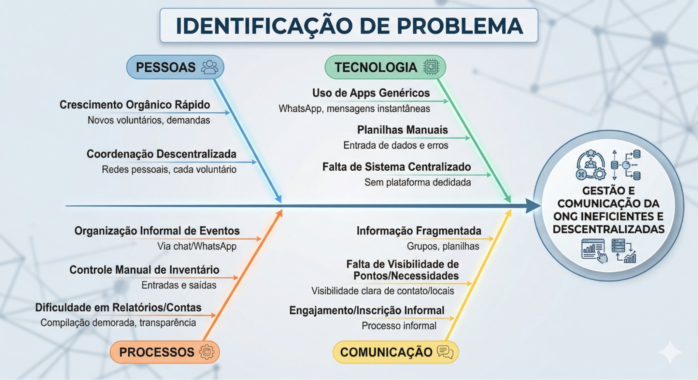

# Desafios do projeto e identificação da oportunidade ou problema

## Identificação do Problema / Oportunidade

O problema central da ONG reside na descentralização e informalidade da comunicação e do controle de doações, realizados majoritariamente por de grupos em aplicativos de troca de mensagem (WhatsApp) e registros manuais em planilhas. Esse modelo gera alto retrabalho operacional, pois o moderador precisa interpretar cada mensagem, registrar promessas manualmente e atualizar o estoque em múltiplos momentos. Além disso, a baixa rastreabilidade dos dados dificulta o acompanhamento das metas de arrecadação em tempo real.
Como consequência, a ONG enfrenta ineficiência logística, risco de inconsistências no estoque físico versus digital e dificuldade na prestação de contas. 

Figura 1: Mapa Identificação de Problema

Fonte: Elaborada com ajuda de inteligência artificial

## Desafios do Projeto
O desenvolvimento e a implantação deste produto enfrentam três desafios principais, divididos entre barreiras operacionais, restrições técnicas e viabilidade a longo prazo:

- **Transição Cultural e Adoção dos Usuários:** O obstáculo operacional mais significativo será a mudança de hábito dos voluntários. Atualmente, a base de doadores está acostumada com a extrema conveniência e informalidade de enviar uma simples mensagem no WhatsApp para registrar sua doação. O desafio da equipe é desenvolver uma interface tão fluida, rápida e intuitiva que consiga vencer a resistência natural à adoção de um novo sistema web, garantindo que o público não abandone o processo de doação por atrito tecnológico.

- **Sustentabilidade Técnica com Custo Zero:** Do ponto de vista de engenharia e arquitetura, o grande desafio é construir uma solução robusta e escalável que atenda à premissa de zero custo de servidor para a ONG. Isso exigirá um planejamento rigoroso da equipe para pesquisar, configurar e integrar serviços em nuvem e bancos de dados que ofereçam planos gratuitos (free tiers) generosos e confiáveis, garantindo que a plataforma permaneça online, segura e com boa performance sem gerar despesas mensais para a instituição.

- **Continuidade e Manutenção Pós-Projeto:** Como a solução está sendo desenvolvida por uma equipe acadêmica, existe o desafio inerente de garantir a sobrevida do software após o fim do ciclo de desenvolvimento. Será necessário construir um sistema autossuficiente e entregar uma documentação técnica e de usuário extremamente clara, garantindo que o moderador Carlos Vaz e a equipe da ONG consigam operar a plataforma, gerenciar eventos e realizar manutenções básicas de forma autônoma, sem criar uma dependência tecnológica contínua dos desenvolvedores originais.

## Histórico de versão

| Versão |    Data    | Descrição  | Autor(es) | Revisor(es)|
| :----: | :--------: | :--------- | :-------: | :---------: |
|  1.0   | 12/04/2026 | Criação da página    |  [Guilherme](https://github.com/GuilhermeOliveira1327)  | [Gustavo](https://github.com/GUGOFO) |