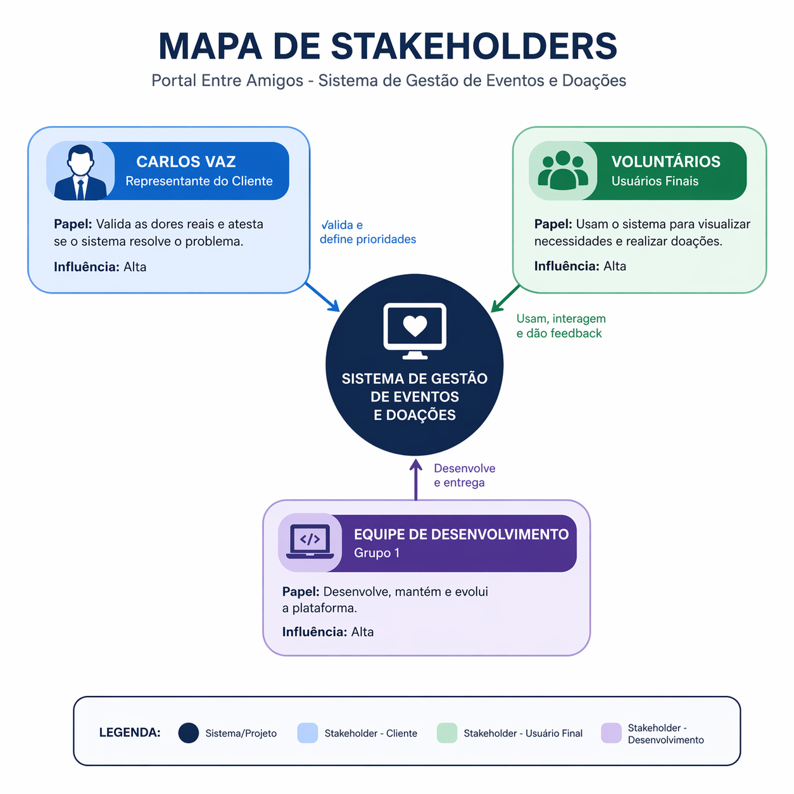

# Mapa de Stakeholder

Figura 1: Mapa de Stakeholder

Fonte: Elaborada com ajuda de inteligência artificial

- **Carlos Vaz (Representante do Cliente):** Responsável por validar as dores reais e atestar se a interface dinâmica e o sistema de gestão de eventos resolvem o problema. Possui alta influência na validação do produto.

- **Voluntários:**  Usuários finais do sistema, cujas interações ditarão a utilidade e a usabilidade da aplicação. Possuem alta influência no uso e adoção do produto.

- **Equipe de Desenvolvimento (Grupo 1):**  Responsáveis pela arquitetura, codificação da aplicação, geração de relatórios e comunicação com demais interessados.

|Stakeholder|Relação|Interesse principal|Influência|
| :------:  | :---: | :--------------:  | :-----:  |
|Carlos Vaz |Representante do Cliente|Centralizar a gestão de eventos, mitigar gargalos logísticos e facilitar a prestação de contas|Alta|
|Voluntários|Usuários Finais|Ter um canal confiável, simples e intuitivo para visualizar necessidades e realizar doações|Alta|
|Equipe Dev|Desenvolvimento|Entregar uma plataforma funcional, escalável e que atenda ao requisito de custo zero de infraestrutura|Alta|

## Histórico de versão

| Versão |    Data    | Descrição  | Autor(es) | Revisor(es)|
| :----: | :--------: | :--------- | :-------: | :---------: |
|  1.0   | 12/04/2026 | Criação da página    |  [Guilherme](https://github.com/GuilhermeOliveira1327)  | [Gustavo](https://github.com/GUGOFO) |