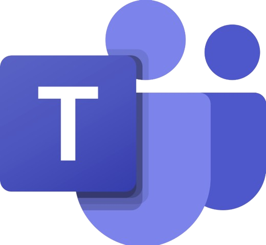
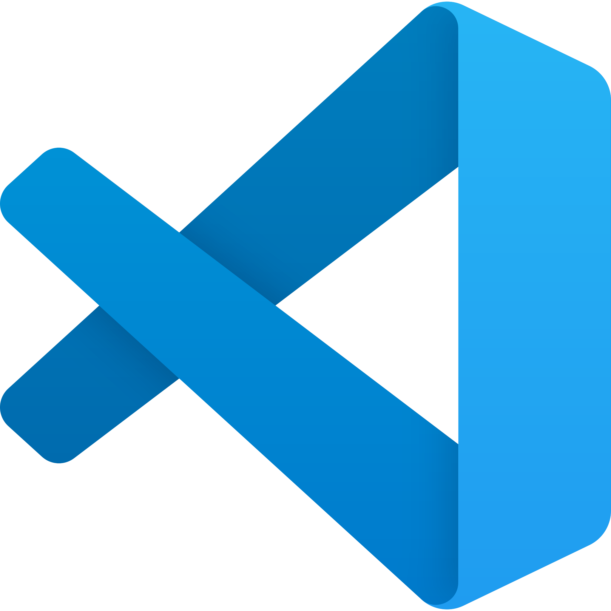
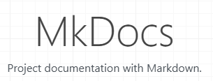
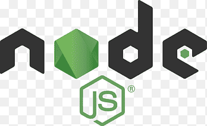

# Ferramentas do Projeto

## Introdução

Para a organização, desenvolvimento e documentação do projeto, foram utilizadas diversas ferramentas de comunicação, colaboração e suporte técnico. Essas ferramentas têm como objetivo facilitar a interação entre os integrantes da equipe e o cliente, além de auxiliar na produção, versionamento e publicação dos artefatos desenvolvidos ao longo do trabalho.

## Ferramentas Utilizadas

|                                                    Logo                                                     |         Ferramenta         | Finalidade                                                      |
| :---------------------------------------------------------------------------------------------------------: | :------------------------: | :-------------------------------------------------------------- |
|           {: style="height:50px;width:50px"}           |         [Github](https://github.com/)        | Versionar, organizar e documentar artefatos do projeto.         |
|       {: style="height:50px;width:50px"}       |    [Microsoft Teams](https://teams.live.com/free)    | Fazer reuniões de forma online e gravação.                      |
|         {: style="height:50px;width:50px"}         |        [WhatsApp](https://www.whatsapp.com/?lang=pt)        | Principal meio de comunicação do grupo.                         |
|      {: style="height:50px;width:50px"}      |      [Google Docs](https://docs.google.com)       | Criação e edição de documentos em grupo.                        |
|          {: style="height:50px;width:50px"}          |        [YouTube](https://www.youtube.com/)         | Hospedagem dos vídeos produzidos.                               |
|     {: style="height:50px;width:50px"}     |   [Visual Studio Code](https://code.visualstudio.com/)   | Criação e edição de arquivos.                                   |
|            {: style="height:50px;width:50px"}            |         [Canva](https://www.canva.com/)          | Usado para criação de RichPicture e imagens.                    |
| {: style="height:50px;width:50px"} | [OpenAI ChatGPT](https://chatgpt.com) | Auxílio em criatividade e textos.                          |
| {: style="height:50px;width:50px"} | [Google Gemini](https://gemini.google.com ) | Auxílio em criatividade e textos.                          |

## Linguagens e Tecnologias Utilizadas

|                                                    Logo                                                     |         Ferramenta         | Finalidade                                                      |
| :---------------------------------------------------------------------------------------------------------: | :------------------------: | :-------------------------------------------------------------- |
|           {: style="height:50px;width:50px"}           |         [MkDocs](https://www.mkdocs.org/)       | Geração e organização da documentação do projeto em formato web.                       |
| {: style="height:50px;width:50px"} | [React](https://react.dev/) | Desenvolvimento da interface do usuário (front-end), proporcionando uma aplicação interativa e responsiva. |
| {: style="height:50px;width:50px"} | [Node.js](https://nodejs.org/) | Execução do ambiente back-end, permitindo a construção da lógica da aplicação. |
| {: style="height:50px;width:50px"} | [MongoDB](https://www.mongodb.com/) | Banco de dados utilizado para armazenamento e gerenciamento das informações do sistema. |

## Histórico de versão

| Versão |    Data    | Descrição  | Autor(es) | Revisor(es)|
| :----: | :--------: | :--------- | :-------: | :---------: |
|  1.0   | 12/04/2026 | Criação da página    |  [Guilherme](https://github.com/GuilhermeOliveira1327)  | [Gustavo](https://github.com/GUGOFO) |