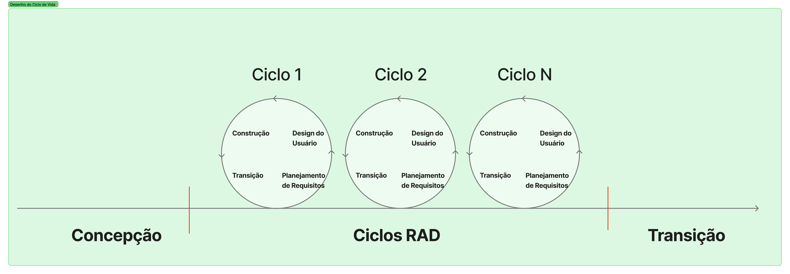

# Estratégias de Engenharia de Software

## Estratégia Priorizada

**Abordagem de Desenvolvimento de Software:** Será utilizada uma abordagem Híbrida.

**Ciclo de Vida:** O ciclo de vida será **Iterativo e Incremental**. O projeto será dividido em ciclos curtos, permitindo que funcionalidades como a "Vitrine de Necessidades" ou o "Sistema de Promessa" sejam desenvolvidas, testadas e validadas separadamente antes da entrega final.

**Processo de Engenharia de Software:RAD Híbrido (OpenUP + RAD)** Este processo combina uma fase inicial de levantamento e organização dos requisitos, baseada no OpenUP, com ciclos rápidos de desenvolvimento inspirados no RAD. A abordagem prioriza a construção incremental de funcionalidades e a participação ativa do cliente para validar a interface, o fluxo de dados e as entregas realizadas ao longo do projeto.

## 3. Quadro Comparativo
Abaixo, apresenta-se uma comparação técnica entre o processo RAD Híbrido (OpenUP + RAD), que combina planejamento inicial estruturado com ciclos rápidos de desenvolvimento, e o Modelo Espiral, focado na análise rigorosa de riscos e planejamento, para fundamentar a escolha da equipe por uma abordagem híbrida.

| Característica | Modelo RAD | Modelo Espiral |
| :--- | :--- | :--- |
| **Tratamento da Incerteza** | Incertezas iniciais são tratadas na fase de Concepção (OpenUP), enquanto ajustes funcionais são resolvidos rapidamente nos ciclos RAD. | Resolvida via análise exaustiva. Se algo é incerto, criam-se alternativas e estudos de viabilidade antes da construção. |
| **Custo de Gestão** | Baixo a Médio. O planejamento inicial reduz retrabalho, mas a gestão continua leve e orientada a entregas rápidas. | Alto. Exige gestores experientes para avaliar riscos e decidir se o projeto deve avançar para o próximo ciclo. |
| **Flexibilidade** | Alta e controlada. Há liberdade para mudanças durante os ciclos RAD, mas com uma base inicial de requisitos e objetivos definidos. | Estruturada. Mudanças são incorporadas no início de cada novo ciclo, garantindo que o impacto seja documentado. |
| **Papel do Protótipo** |Os protótipos são usados para validar rapidamente funcionalidades e interfaces, podendo evoluir para partes do sistema final. | É uma ferramenta de prova de conceito. Serve para testar uma funcionalidade crítica ou interface antes do desenvolvimento real. |
| **Rigor e Formalidade** | Moderado. A fase de Concepção adiciona organização e documentação inicial, enquanto os ciclos RAD mantêm comunicação ágil e prática. | Maior. Cada volta da espiral gera revisões e aprovações formais (milestones) que garantem a integridade do sistema. |
| **Tamanho da Equipe** | Equipes pequenas a médias, colaborativas e capazes de se dividir em frentes paralelas de desenvolvimento. | Pode envolver múltiplas frentes de trabalho e especialistas dedicados apenas à segurança e riscos. |
| **Segurança e Missão Crítica** | Adequado para sistemas com requisitos moderados de segurança, equilibrando rapidez de entrega e organização inicial. | Excelente. É o modelo preferido para sistemas onde erros custam vidas ou prejuízos financeiros bilionários. |

---

## 3.3 Justificativa 

A escolha pelo processo RAD Híbrido (OpenUP + RAD) justifica-se pela necessidade de equilibrar um planejamento inicial estruturado com entregas rápidas e frequentes, permitindo a validação constante com a ONG e reduzindo os riscos de desenvolver funcionalidades que não atendam às necessidades reais dos usuários.

Os principais motivos para a adoção do RAD Híbrido são:

- **Levantamento Estruturado de Requisitos**: A fase inicial inspirada no OpenUP permite compreender o problema, definir os requisitos do sistema e alinhar as expectativas dos stakeholders antes do início da implementação.

- **Prototipação e Validação Rápida**: O projeto prioriza a construção de protótipos funcionais e incrementos de software que podem ser avaliados continuamente pelos usuários, possibilitando ajustes precoces na interface e na experiência de uso.

- **Envolvimento Ativo do Usuário**: A colaboração constante com a ONG garante que a plataforma evolua de acordo com as necessidades dos voluntários e gestores, tornando o sistema mais intuitivo e aderente à realidade da organização.

- **Desenvolvimento Incremental**: O software é desenvolvido por meio de ciclos iterativos, permitindo que funcionalidades sejam entregues gradualmente, testadas e refinadas ao longo do projeto.

- **Ciclos Curtos de Construção**: A utilização de ciclos RAD com duração reduzida favorece entregas frequentes de funcionalidades completas, acelerando o processo de validação e correção.

- **Flexibilidade e Adaptação**: A combinação entre planejamento inicial e desenvolvimento iterativo permite incorporar mudanças de requisitos sem comprometer os objetivos gerais do projeto.

- **Adequação ao Contexto Acadêmico**: A estratégia híbrida possibilita a divisão da equipe em múltiplas frentes de trabalho, favorecendo o desenvolvimento paralelo de funcionalidades e o cumprimento dos prazos estabelecidos pela disciplina.

## Histórico de versão

| Versão |    Data    | Descrição  | Autor(es) | Revisor(es)|
| :----: | :--------: | :--------- | :-------: | :---------: |
|  1.0   | 12/04/2026 | Criação da página    |  [Guilherme](https://github.com/GuilhermeOliveira1327)  | [Gustavo](https://github.com/GUGOFO) 
|  1.1   | 15/06/2026 | edição da página para RAD Híbrido   |  [Guilherme](https://github.com/GuilhermeOliveira1327)  | [Gustavo](https://github.com/GUGOFO) |