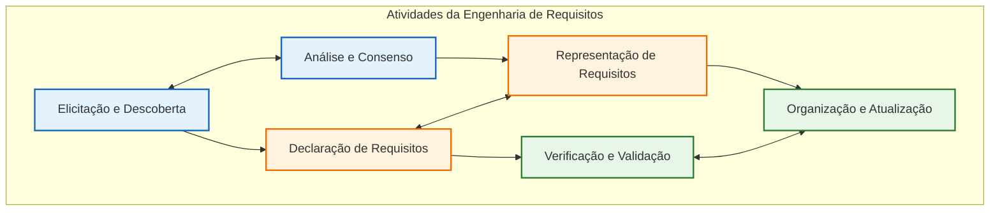
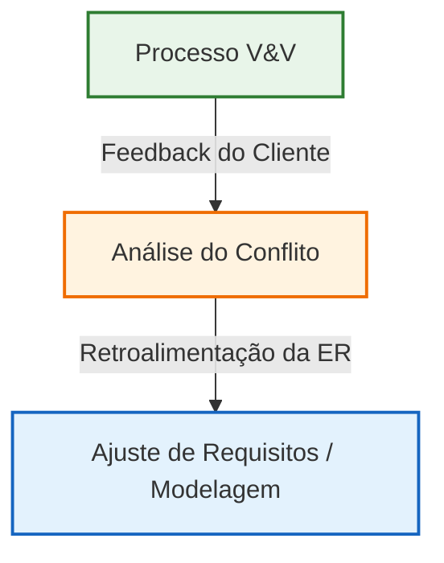

# Lições Aprendidas com a Disciplina

A vivência prática no desenvolvimento do **Portal Entre Amigos** para a **ONG Ação Entre Amigos BSB** permitiu consolidar de forma empírica os conceitos teóricos de Engenharia de Requisitos. A seguir, analisamos criticamente o percurso do projeto sob a luz dos conceitos, valores e princípios fundamentais da obra *"Requisitos de Software – Comunicação é tudo!"* (Marsicano, 2026).

---

## 1. Adaptabilidade Contextual e Abordagem Híbrida (Capítulos 2, 3 e 4)

O livro ensina no **Capítulo 2.7** que a *Adaptabilidade Contextual* é a capacidade de selecionar e combinar elements metodológicos de acordo com a realidade de cada projeto. Essa escolha é influenciada por particularidades do projeto (escala, estabilidade dos requisitos, restrições e perfil de stakeholders), domínio de aplicação e cultura organizacional.

### Nossa Experiência:

*   **Particularidades do Projeto e do Cliente**: Carlos Vaz é um cliente de perfil não-técnico (Capítulo 9.6.6), gerindo uma ONG com infraestrutura limitada e dependente de planilhas manuais. Lançar mão de uma abordagem puramente dirigida por planos (*Cascata*) seria ineficaz devido à volatilidade das necessidades, enquanto um modelo puramente ágil em equipe distribuída poderia carecer de estrutura para as entregas acadêmicas.

*   **A Escolha Híbrida (RAD + OpenUP)**: Adotamos um ciclo de vida adaptativo (Capítulo 3.2.1.6). Utilizamos a fase de **Concepção do OpenUP** (Capítulo 4.4) para estruturar o entendimento do problema, modelar a visão do produto e delimitar fronteiras. Para a construção incremental, adotamos os **Ciclos RAD** (Capítulo 4.9), nos quais priorizamos a prototipagem rápida e interativa para obter feedback precoce e direto do cliente, mantendo o escopo flexível para maximizar o valor entregue.

---

## 2. As Seis Atividades da Engenharia de Requisitos (Capítulo 5)

O **Capítulo 5.3** descreve a ER como um conjunto de práticas iterativas e entrelaçadas, em vez de fases estritamente sequenciais.

*   **Elicitação e Descoberta**: Investigamos o fluxo manual de mantimentos da ONG. Diferenciamos *desejos* (como a inserção de recursos estéticos secundários) de *necessidades reais* (como a integridade e atualização automática do saldo de estoque na **US12** e **US13**), revelando requisitos latentes de usabilidade para voluntários seniores.

*   **Análise e Consenso**: Realizamos workshops de priorização conjunta utilizando o método **MoSCoW** (Capítulo 8.4.2). Mediamos conflitos de interesses entre a necessidade regulatória de exclusão de dados pessoais (LGPD na **US05**) e a facilidade de login solicitada pela moderação.

*   **Declaração**: Traduzimos as necessidades em Histórias de Usuário (US) escritas sob o formato estruturado *“Como <papel>, quero <ação>, para <valor>”* (Capítulo 9.4.3.1) acompanhadas de Critérios de Aceitação claros e mensuráveis.

*   **Representação**: Usamos representações informais e semiformais (Capítulo 10). Em vez de documentos textuais extensos, criamos protótipos de alta fidelidade interativos no Figma e mapeamos as transições lógicas de status (ativa, inativa, encerrada) das campanhas por meio de diagramas de estados (Capítulo 10.6).

*   **Verificação e Validação (V&V)**: Conduzimos revisões cruzadas e inspeções baseadas em listas de verificação internas para validar o DoR (Definition of Ready) e o DoD (Definition of Done) (Capítulo 11.5.8), e validamos os incrementos de software diretamente com o cliente em reuniões virtuais de demonstração.

*   **Organização e Atualização**: Mantivemos o Product Backlog atualizado ao longo de 7 ciclos de desenvolvimento RAD, adaptando o escopo sucessivamente conforme redefinições de prioridade emergiam do contato com a comunidade.

---

## 3. A Materialização dos Valores da ER (Capítulo 5.4.1)

A Engenharia de Requisitos é, por essência, uma disciplina humana e sociotécnica. Alinhamos nossa postura com os Sete Valores propostos no livro:

*   **Comunicação**: Foi o eixo do projeto. Traduzimos termos contábeis complexos em tabelas limpas de estoque e notas fiscais de forma compreensível para todos.

*   **Simplicidade**: Mantivemos o foco no desenvolvimento do MVP, eliminando especificações supérfluas (como carrosséis de parceiros nos ciclos de código) para garantir a entrega rápida das regras fundamentais de moderação de doações.

*   **Feedback**: Buscamos ciclicamente o retorno do cliente a cada sprint, usando a discordância como um instrumento construtivo de refinamento do produto.

*   **Coragem**: Fomos transparentes com o cliente para sinalizar limites de escopo e restrições técnicas de tempo no final do semestre.

*   **Respeito**: Consideramos as diferentes visões dos membros do grupo e as restrições logísticas vividas no cotidiano da ONG.

*   **Compromisso**: Formalizado através do cumprimento rigoroso das metas traçadas para os Ciclos RAD no cronograma.

*   **Confiança**: Construída com o cliente Carlos de forma incremental, demonstrando através de código funcional que o sistema atendia suas preocupações contábeis e de usabilidade.

---

## 4. O Ciclo de Aprendizagem de V&V e Retroalimentação da ER (Capítulo 11)

De acordo com o **Capítulo 11.10** do livro, a V&V não "fecha" o requisito; ela funciona como um mecanismo contínuo de controle de ruído e aprendizagem. Quando o cliente discorda ou rejeita uma proposta, essa discordância é uma informação crítica que deve retroalimentar a análise e a elicitação:

A aplicação das técnicas de V&V nos permitiu evitar as duas maiores armadilhas no fechamento do semestre:

1.  **Burocratização**: Inicialmente, a equipe tendeu a tratar DoR e DoD como rituais estáticos de preenchimento de checklist. Superamos isso ao acoplar as diretrizes diretamente nas Histórias de Usuário no repositório, tornando-as acionáveis e integradas ao fluxo de código (Capítulo 11.5.8).

2.  **Miopia Textual**: A equipe não se limitou a polir a gramática dos requisitos textuais. Fizemos a análise de consistência entre a especificação declarativa e as representações de protótipos de alta fidelidade e interfaces de produção. Isso revelou que regras de upload (limite de 5MB e restrição de tipos de arquivo RNF10 na **US18**) necessitavam de validações de segurança ativas no backend.

---

## Histórico de versão

| Versão |    Data    | Descrição  | Autor(es) | Revisor(es)|
| :----: | :--------: | :--------- | :-------: | :---------: |
|  1.0   | 01/07/2026 | Criação do consolidado de Lições Aprendidas com a Disciplina | [Artur Fernandes Galdino](https://github.com/ArturFGaldino) | Equipe |
