# Ciclo RAD 1

**Período:** 26/05 a 01/06  
**Responsáveis:** [Artur Fernandes Galdino](https://github.com/ArturFGaldino), [Guilherme Oliveira](https://github.com/GuilhermeOliveira1327) e [Kaio Amoury Sasaki Acacio](https://github.com/KaioAmouryUnB)  
**Requisitos Alocados:** [RF16 - Exibir informações institucionais](../../13_requisitos/requisitos.md#rf16)

---

## Planejamento dos Requisitos

### 1. Página Inicial (Home)
Destinada a ser o primeiro ponto de contato do público com a plataforma, consolidando dados operacionais e de engajamento:

* **Dados da Ativa:** Exibição clara das ações correntes, métricas e impacto social da organização.
* **Informações Básicas:** Apresentação da identidade visual e contatos essenciais para voluntariado e parcerias.

### 2. Página "Quem Somos"
Interface dedicada a aprofundar o nível de conexão institucional com os usuários e visitantes da plataforma:

* **História da Organização:** Linha do tempo ou narrativa sobre a fundação e evolução da ONG.
* **Diretrizes Organizacionais:** Apresentação explícita da **Missão, Visão e Valores** que regem as tomadas de decisão da entidade.

---

## Design do Usuário

O processo de design foi conduzido em estreita colaboração com o cliente, garantindo que as interfaces traduzissem com fidelidade as necessidades apresentadas.

Abaixo estão dispostos os protótipos elaborados para este ciclo:

### Página Inicial

#### Versão Desktop
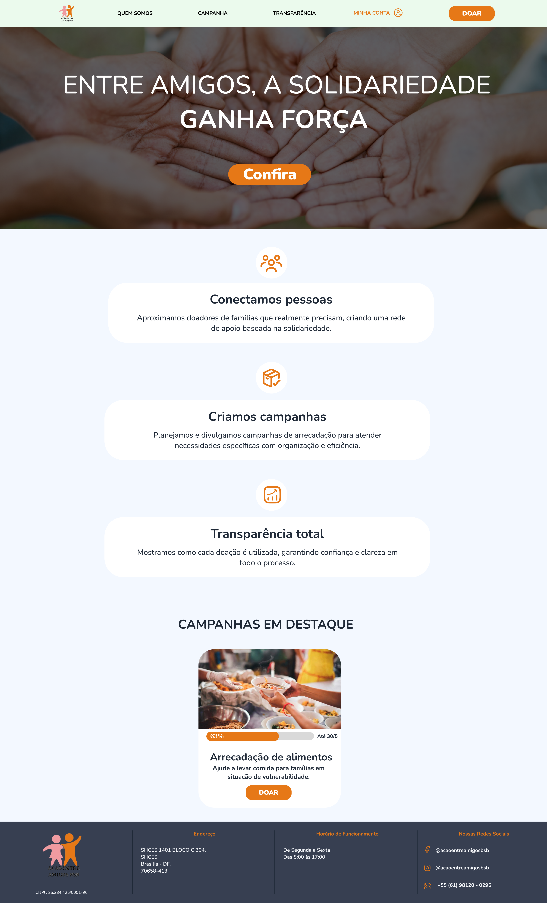{ width="40%" style="display: block; margin: 0 auto;" }

#### Versão Mobile
{ width="100" style="display: block; margin: 0 auto;" }

---

### Página "Quem Somos"

#### Versão Desktop
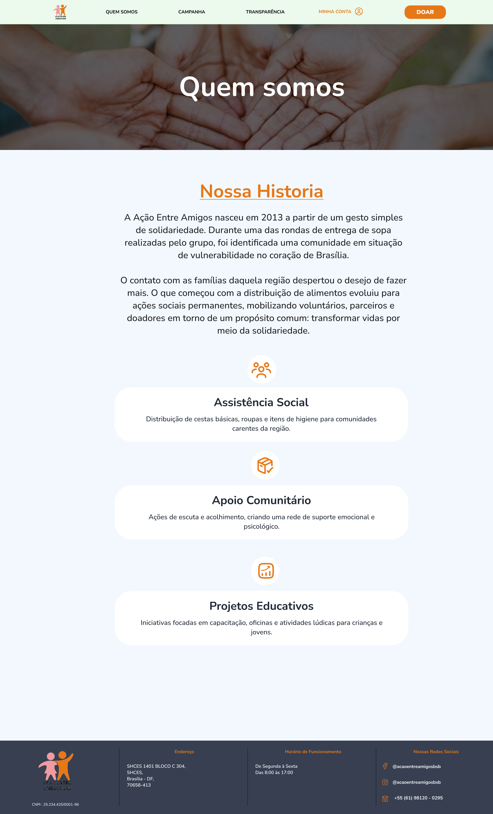{ width="40%" style="display: block; margin: 0 auto;" }

#### Versão Mobile
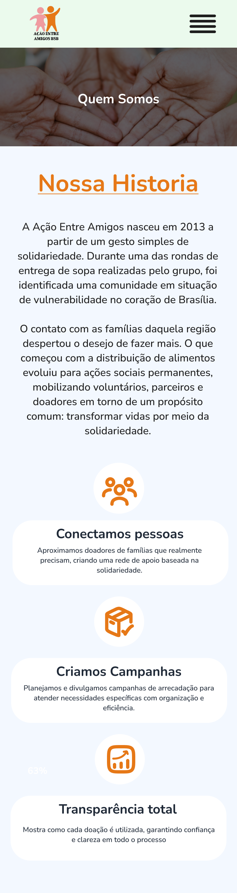{ width="70" style="display: block; margin: 0 auto;" }

---

## Construção

Nesta etapa de desenvolvimento, a equipe traduziu os requisitos planejados e os protótipos validados em componentes funcionais.

### Código Fonte
Os componentes desenvolvidos, os estilos estruturados e as páginas integradas para a exibição das informações institucionais encontram-se mapeados no repositório oficial do projeto:

**Link para o repositório/branch de desenvolvimento:** [Código Fonte da Construção - Ciclo 1](https://github.com/GuilhermeOliveira1327)

#### 1. Página Inicial

##### Versão Desktop
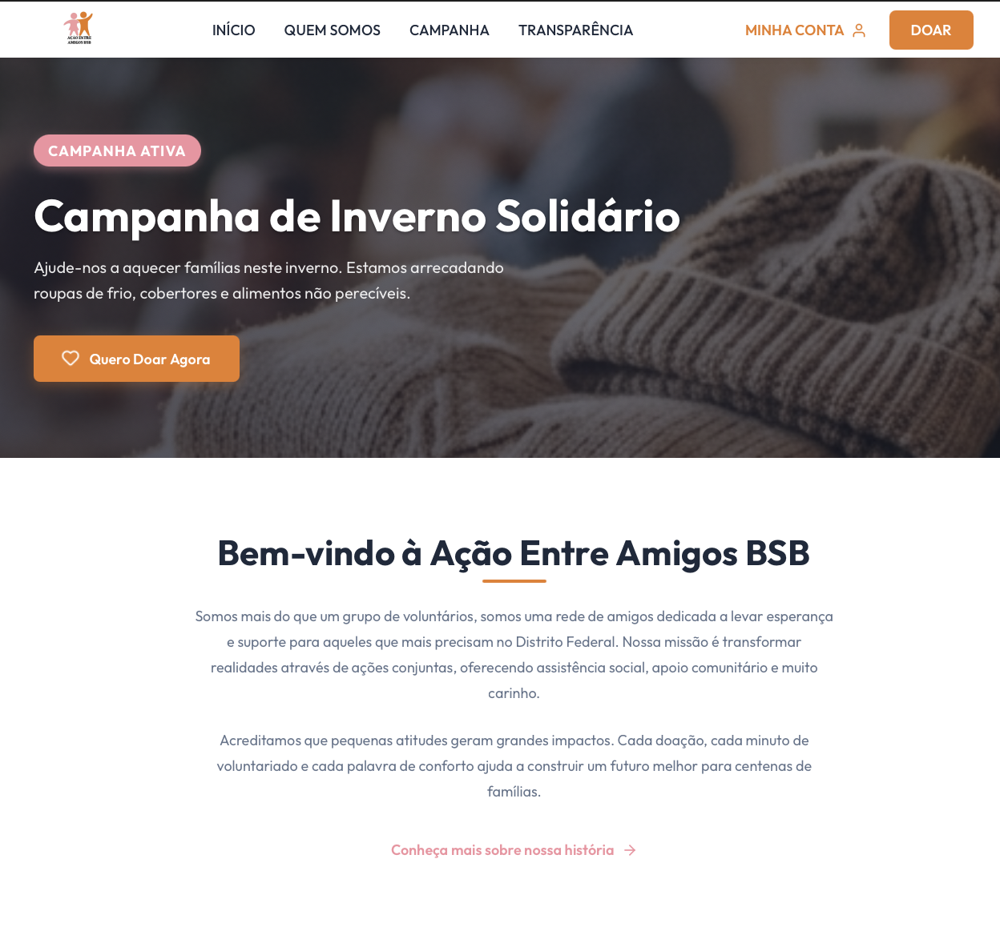{ width="50%" style="display: block; margin: 0 auto;" }
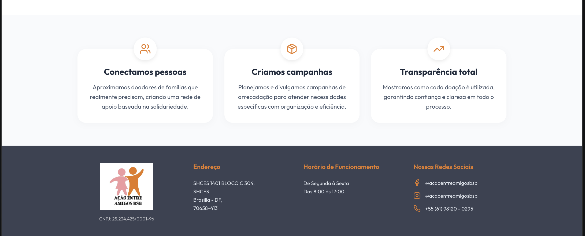{ width="50%" style="display: block; margin: 0 auto;" }

##### Versão Mobile
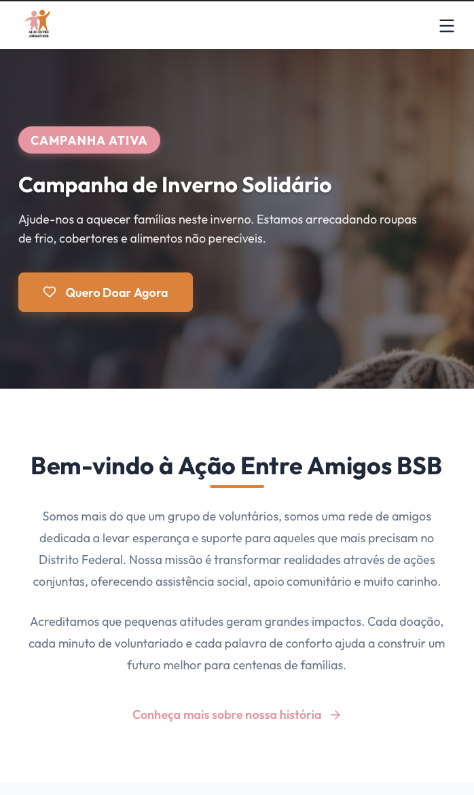{ width="150" style="display: block; margin: 0 auto;" }
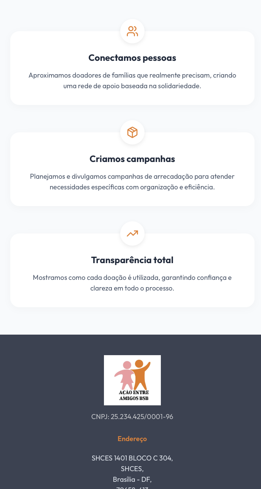{ width="150" style="display: block; margin: 0 auto;" }

---

#### 2. Página "Quem Somos"

##### Versão Desktop
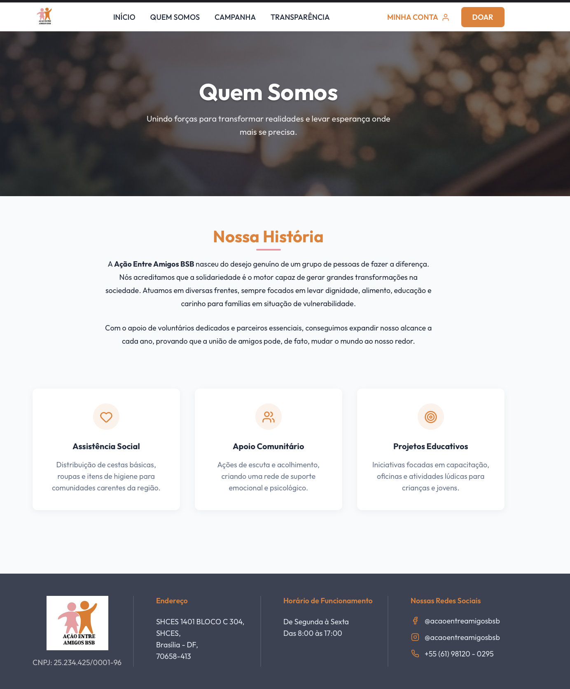{ width="50%" style="display: block; margin: 0 auto;" }

##### Versão Mobile

parte 1

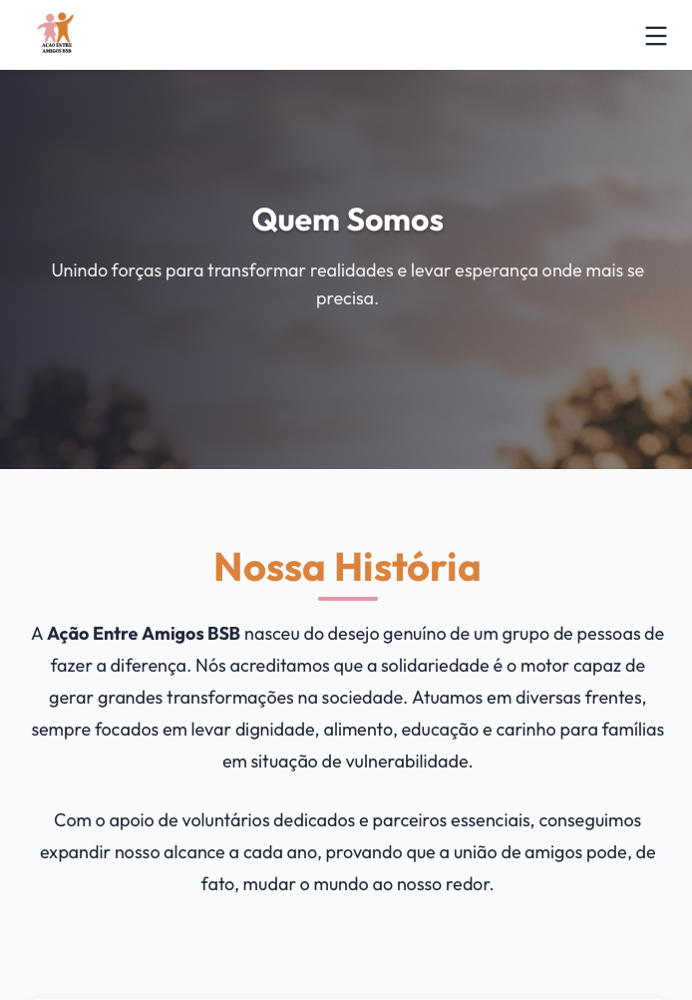{ width="150" style="display: block; margin: 0 auto;" }

parte 2

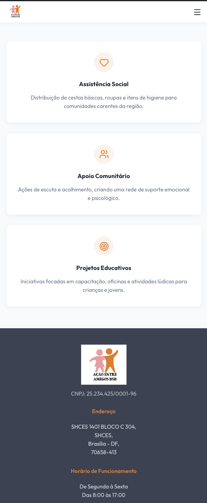{ width="150" style="display: block; margin: 0 auto;" }
---

## Transicao

Caso queira analisar detalhadamente o comportamento estrutural do código implementado, acesse o link a seguir:

**Link para análise técnica:** [Repositório de Transição - Ciclo 1](https://github.com/GuilhermeOliveira1327)

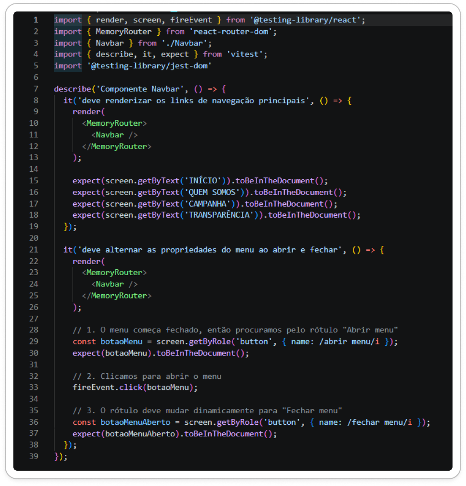{ width="400" style="display: block; margin: 0 auto;" }

---

## Histórico de Versão

| Versão | Data | Descrição | Autor(es) | Revisor(es) |
| :---: | :---: | :--- | :---: | :---: |
| 1.0 | 13/06/2026 | Documentação inicial do planejamento, design e construção do Ciclo RAD 2 |  [Gustavo Gomes](https://github.com/GUGOFO) | Equipe |