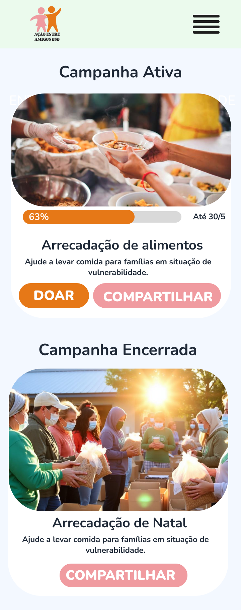
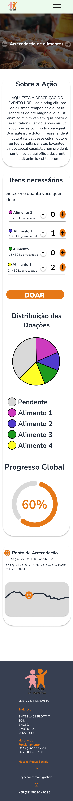
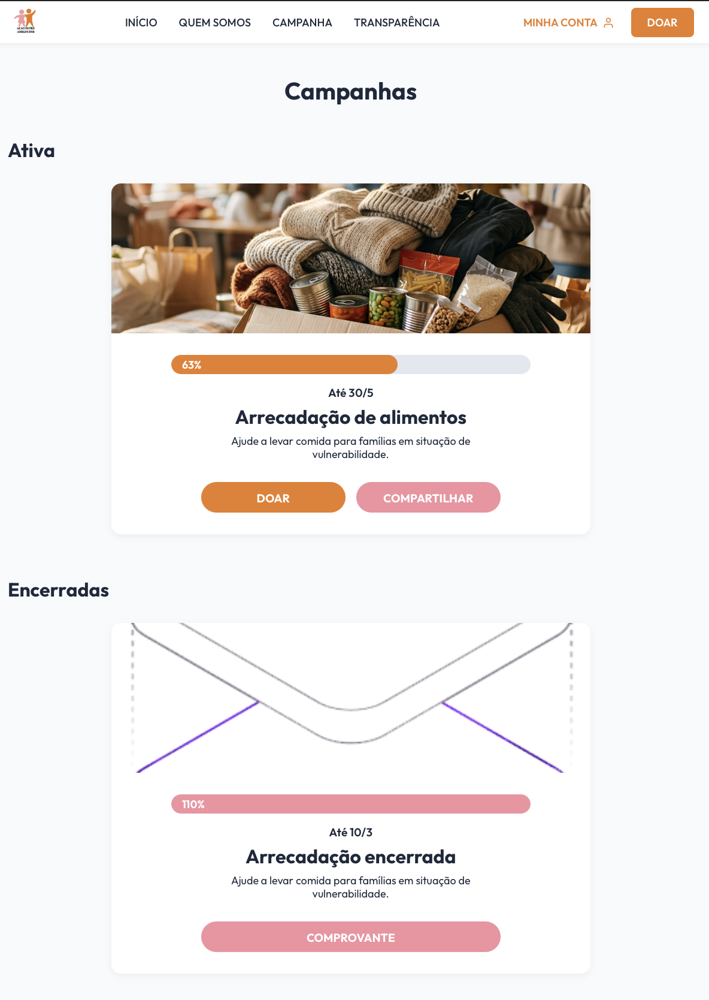
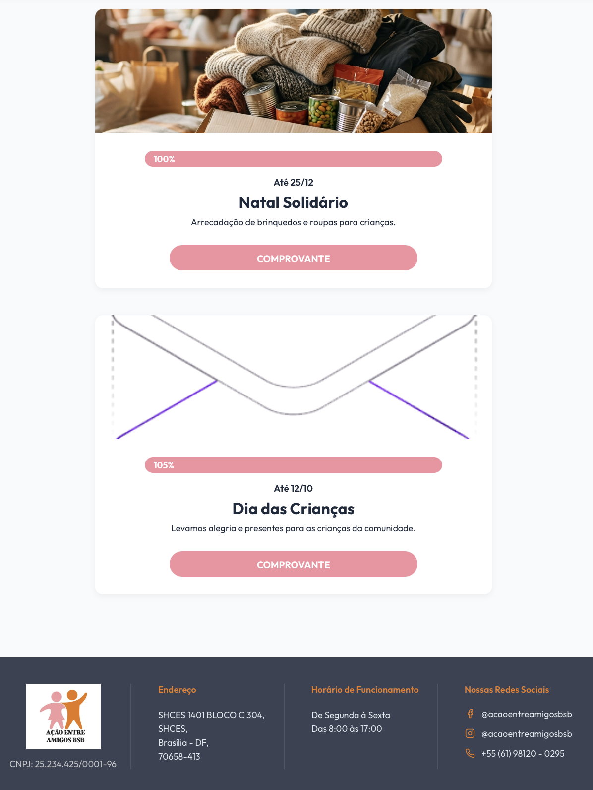
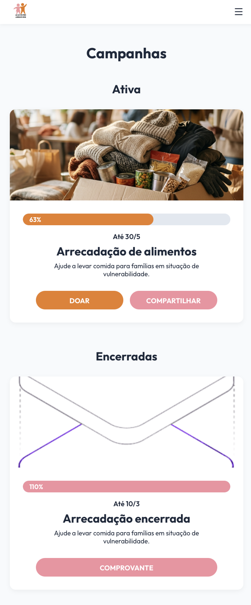
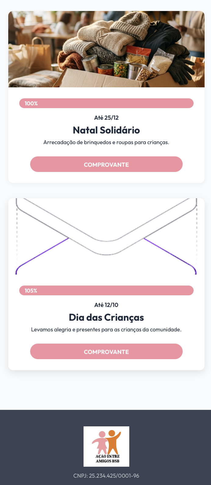
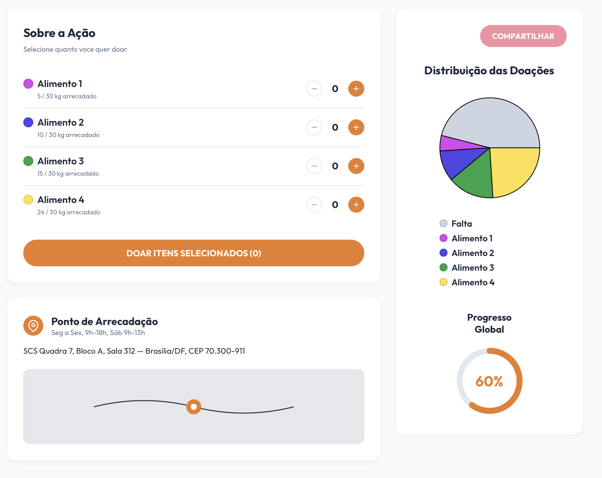
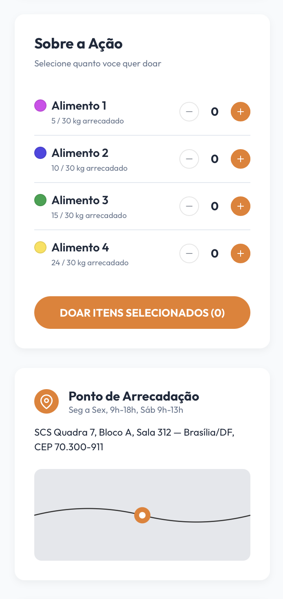

# Ciclo RAD 2

**Período:** 26/05 a 01/06  
**Responsáveis:** [Edson Pereira Roldao Filho](https://github.com/edso-n), [Gustavo Gomes Fornaciari](https://github.com/GUGOFO), [Leonardo de Aquino Silveira Braga](https://github.com/surpesaiajin)  
**Requisitos Alocados:** [RF14 - Exibir eventos](../../13_requisitos/requisitos.md#rf14)

---

## Planejamento dos Requisitos

Neste segundo ciclo de desenvolvimento utilizando a metodologia RAD (Rapid Application Development), a equipe focou na estruturação e exibição das ações de arrecadação da organização, cobrindo o **RF14** (vinculado à **US14** do Backlog). O principal objetivo foi segmentar a experiência em duas interfaces essenciais para engajamento e transparência:

### 1. Página de Campanhas (Geral)
Destinada a centralizar todas as frentes de arrecadação e mobilização social da ONG:

* **Campanha Ativa:** Destaque visual principal para a ação de arrecadação que está ocorrendo no momento atual, incentivando a conversão direta de doações.
* **Últimas Campanhas Fechadas:** Histórico e mural das ações que já foram encerradas, reforçando a prestação de contas e o impacto histórico da organização.

### 2. Página da Campanha (Interna)
Interface dedicada a detalhar minuciosamente a mobilização que se encontra em andamento:

* **Dados Consolidados:** Exibição detalhada contendo a descrição dos objetivos, metas financeiras ou de suprimentos da campanha ativa.
* **Informações Estuturadas:** Dados complementares necessários para orientar o voluntário ou doador sobre como e onde contribuir.

---

## Design do Usuário

O processo de design foi conduzido em estreita colaboração com o cliente, garantindo que as interfaces traduzissem com fidelidade as necessidades apresentadas.

Abaixo estão dispostos os protótipos elaborados para este ciclo:

### Página de Campanhas

#### Versão Desktop
{ width="40%" style="display: block; margin: 0 auto;" }

#### Versão Mobile
{ width="150" style="display: block; margin: 0 auto;" }

---

### Página da Campanha (Detalhes)

#### Versão Desktop
{ width="40%" style="display: block; margin: 0 auto;" }

#### Versão Mobile
{ width="70" style="display: block; margin: 0 auto;" }

---

## Construção

Nesta etapa de desenvolvimento, a equipe traduziu os requisitos planejados e os protótipos validados em componentes funcionais.

### Código Fonte
Os componentes desenvolvidos, os estilos estruturados e as páginas integradas para a exibição das informações das campanhas encontram-se mapeados no repositório oficial do projeto:

**Link para o repositório/branch de desenvolvimento:** [Código Fonte da Construção - Ciclo 2](https://github.com/GUGOFO)

#### 1. Página de Campanhas

##### Versão Desktop
{ width="50%" style="display: block; margin: 0 auto;" }
{ width="50%" style="display: block; margin: 0 auto;" }

##### Versão Mobile
{ width="150" style="display: block; margin: 0 auto;" }
{ width="150" style="display: block; margin: 0 auto;" }

---

#### 2. Página da Campanha

##### Versão Desktop
{ width="50%" style="display: block; margin: 0 auto;" }
{ width="50%" style="display: block; margin: 0 auto;" }

##### Versão Mobile

{ width="150" style="display: block; margin: 0 auto;" }
{ width="150" style="display: block; margin: 0 auto;" }

---

## Transição

Caso queira analisar detalhadamente o comportamento estrutural do código implementado, acesse o link a seguir:

**Link para análise técnica:** [Repositório de Transição - Ciclo 2](https://github.com/GUGOFO)

---

## Histórico de Versão

| Versão | Data | Descrição | Autor(es) | Revisor(es) |
| :---: | :---: | :--- | :---: | :---: |
| 1.0 | 13/06/2026 | Documentação inicial do planejamento, design e construção do Ciclo RAD 2 |  [Gustavo Gomes](https://github.com/GUGOFO) | Equipe |