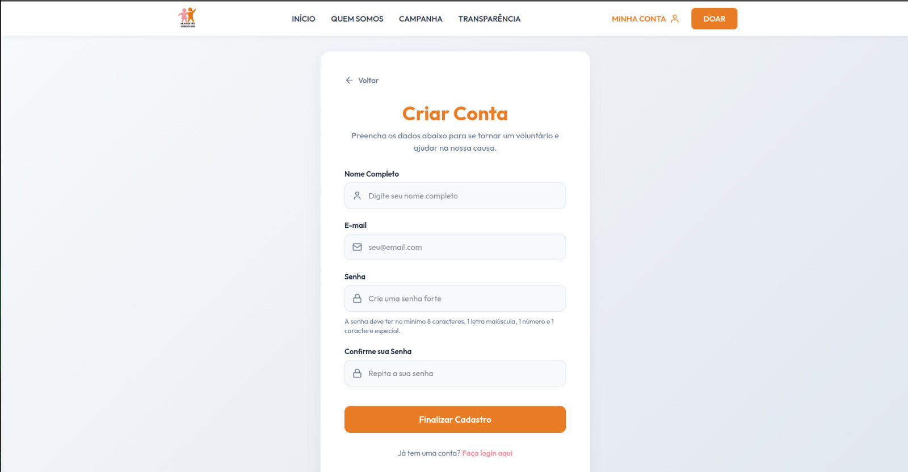

# Ciclo RAD 3

**Período:** 09/06 a 15/06  
**Responsáveis:** [Edson Pereira Roldao Filho](https://github.com/edso-n), [Gustavo Gomes Fornaciari](https://github.com/GUGOFO), [Leonardo de Aquino Silveira Braga](https://github.com/surpesaiajin)  
**Requisitos Alocados:** [RF01 - Cadastrar usuário](../../../13_requisitos/requisitos.md#rf01)

---

## Planejamento dos Requisitos

Neste terceiro ciclo de desenvolvimento utilizando a metodologia RAD (Rapid Application Development), a equipe focou na esteira de autenticação e segurança de acessos, cobrindo o **RF01** (vinculado à **US01** do Backlog). O principal objective foi estruturar uma página de cadastro intuitiva e segura, garantindo o cumprimento de regras de integridade de dados e proteção de credenciais:

### 1. Fluxo de Criação de Conta
Interface de formulário limpa e direta para novos voluntários se registrarem na plataforma da ONG:

* **Campos Obrigatórios:** Captura padronizada de Nome Completo, E-mail, Senha e Confirmação de Senha.
* **Validações de Segurança:** Implementação de feedbacks visuais em tempo real para senhas fortes e checagem de igualdade entre os campos de senha.

---

## Design do Usuário

O processo de design foi conduzido em estreita colaboração com o cliente, visando criar uma experiência acolhedora que minimize a taxa de abandono no momento do registro.

Abaixo estão reservados os espaços para os protótipos elaborados para este ciclo:

### Página de Cadastro (Criar Conta)

#### Versão Desktop
{ width="60%" style="display: block; margin: 0 auto;" }

#### Versão Mobile
{ width="200" style="display: block; margin: 0 auto;" }

---

## Construção

Nesta etapa de desenvolvimento, a equipe traduziu as especificações em código frontend funcional, estruturando as validações nativas e os estados de manipulação de formulário no React/Next.js.

### Código Fonte
Os componentes desenvolvidos, os estilos estruturados e as regras de tratamento de erros para a criação de contas encontram-se mapeados no repositório oficial do projeto:

**Link para o repositório/branch de desenvolvimento:** [Código Fonte da Construção - Ciclo 3](https://github.com/GUGOFO)

#### 1. Página de Cadastro Implementada

##### Versão Desktop
{ width="100%" style="display: block; margin: 0 auto;" }

##### Versão Mobile
{ width="200" style="display: block; margin: 0 auto;" }

---

## Transição

Esta fase compreendeu a auditoria de acessibilidade do formulário de registro, a verificação do comportamento responsivo do componente de caixas de texto e a preparação do módulo para integração futura com a lógica de persistência e criptografia.

Caso queira analisar detalhadamente o comportamento estrutural do código implementado, acesse o link a seguir:

**Link para análise técnica:** [Repositório de Transição - Ciclo 3](https://github.com/GUGOFO)

---

## Histórico de Versão

| Versão | Data | Descrição | Autor(es) | Revisor(es) |
| :---: | :---: | :--- | :---: | :---: |
| 1.0 | 15/06/2026 | Documentação inicial do planejamento, design e construção do Ciclo RAD 3 |  [Gustavo Gomes](https://github.com/GUGOFO) | Equipe |