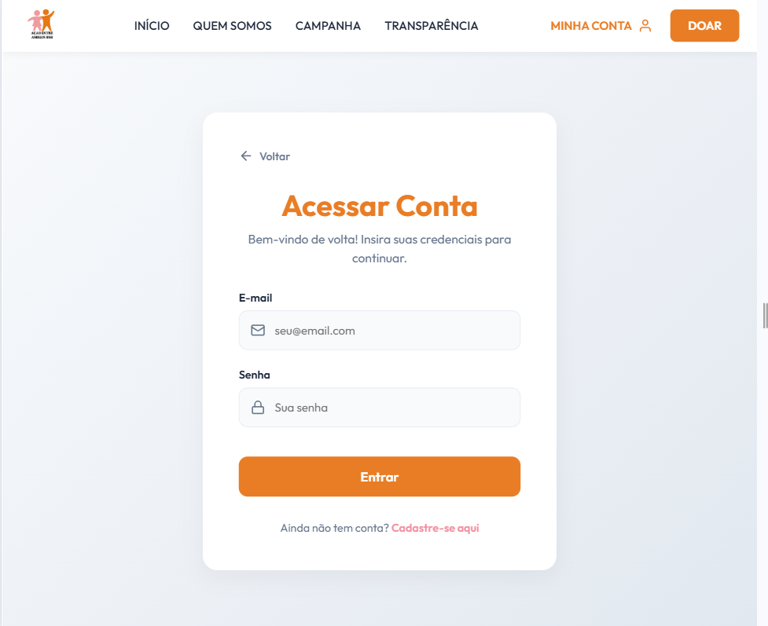
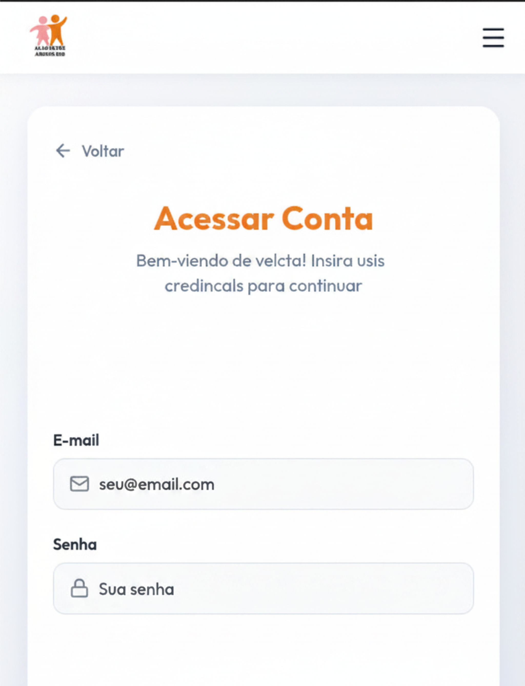

# Ciclo RAD 3 - RF02

**Período:** 01/06 a 08/06  
**Responsáveis:** [Edson Pereira Roldao Filho](https://github.com/edso-n), [Gustavo Gomes Fornaciari](https://github.com/GUGOFO), [Leonardo de Aquino Silveira Braga](https://github.com/surpesaiajin)  
**Requisitos Alocados:** [RF02 - Login de usuário](../../../13_requisitos/requisitos.md#rf02)

---

## Planejamento dos Requisitos

Neste terceiro ciclo de desenvolvimento utilizando a metodologia RAD (Rapid Application Development), a equipe focou no refinamento do sistema de autenticação, cobrindo o **RF02** (vinculado à **US02** do Backlog). O objetivo principal foi estruturar uma página de login segura e responsiva, validando as credenciais de acesso do usuário para entrada no sistema:

### 1. Fluxo de Autenticação (Login)
Interface de formulário limpa para acesso de voluntários e moderadores cadastrados na plataforma da ONG:

* **Entrada de Credenciais:** Captura e validação de formato para os campos obrigatórios de E-mail e Senha.
* **Tratamento de Exceções:** Implementação de mensagens de erro genéricas e amigáveis para falhas de autenticação, preservando a segurança das contas.

---

## Design do Usuário

O processo de design foi conduzido em estreita colaboração com o cliente, visando criar uma experiência de acesso ágil, segura e integrada com os fluxos de navegação já validados.

Abaixo estão reservados os espaços para os protótipos elaborados para este ciclo:

### Página de Login (Acessar Conta)

#### Versão Desktop
{ width="40%" style="display: block; margin: 0 auto;" }

#### Versão Mobile
{ width="100" style="display: block; margin: 0 auto;" }

---

## Construção

Nesta etapa de desenvolvimento, a equipe traduziu as especificações de design em código de frontend funcional, estruturando a manipulação de estados do formulário e o controle de erros visuais no React/Next.js.

### Código Fonte
Os componentes desenvolvidos, os estilos estruturados e as regras de validação de credenciais encontram-se mapeados no repositório oficial do projeto:

**Link para o repositório/branch de desenvolvimento:** [Código Fonte da Construção - Ciclo 3](https://github.com/GUGOFO)

#### 1. Página de Login Implementada

##### Versão Desktop
{ width="50%" style="display: block; margin: 0 auto;" }

##### Versão Mobile
{ width="150" style="display: block; margin: 0 auto;" }

---

## Transição

Esta fase compreendeu a auditoria do formulário de autenticação, a validação de foco de teclado nas caixas de texto e a preparação do componente para integração com os microsserviços de criptografia e gerenciamento de sessões do backend.

Caso queira analisar detalhadamente o comportamento estrutural do código implementado, acesse o link a seguir:

**Link para análise técnica:** [Repositório de Transição - Ciclo 3](https://github.com/GUGOFO)

---

## Histórico de Versão

| Versão | Data | Descrição | Autor(es) | Revisor(es) |
| :---: | :---: | :--- | :---: | :---: |
| 1.0 | 15/06/2026 | Documentação inicial do planejamento, design e construção do RF02 no Ciclo 3 |  [Gustavo Gomes](https://github.com/GUGOFO) | Equipe |