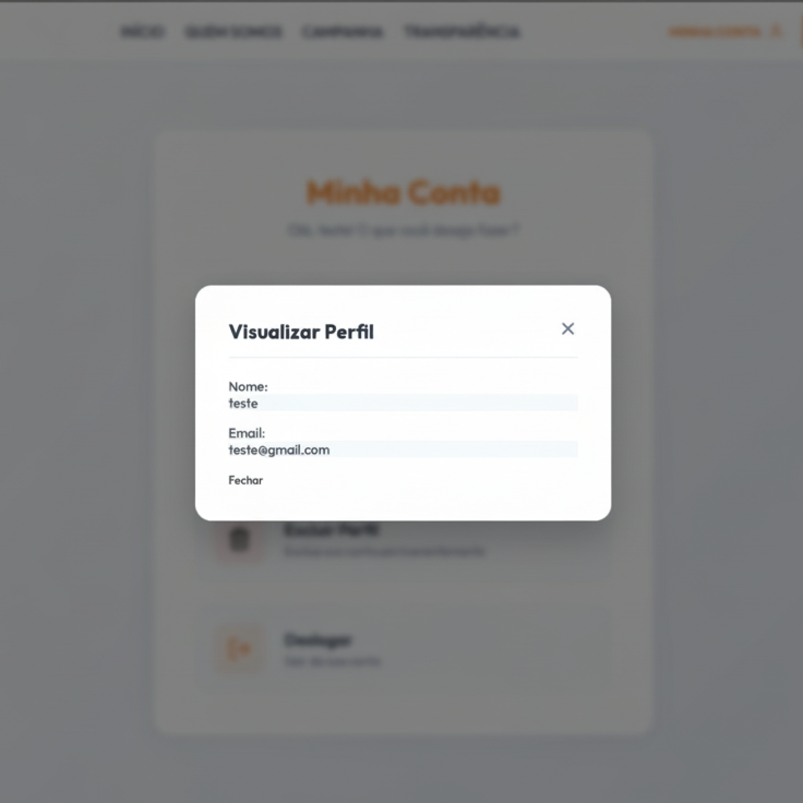
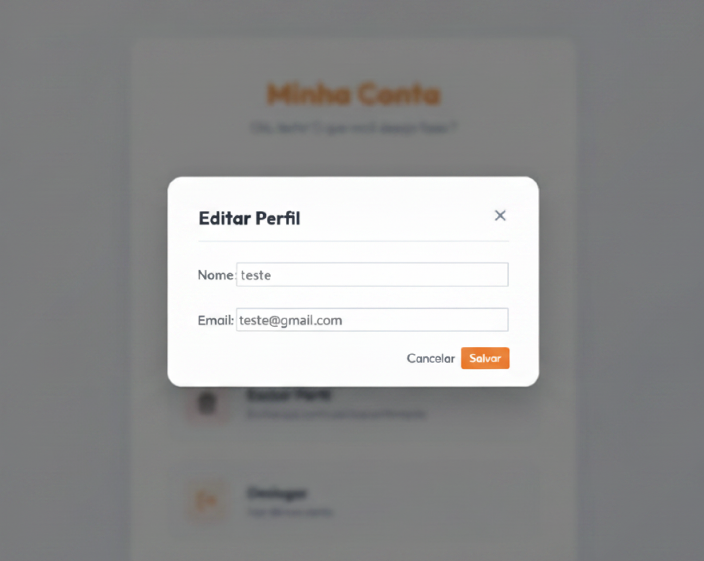
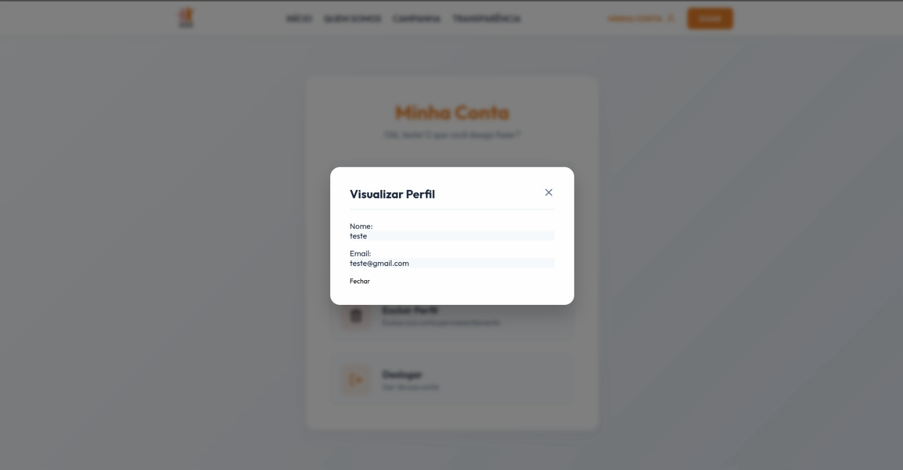
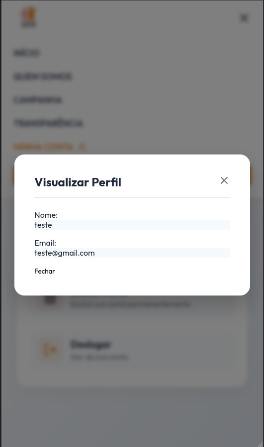

# Ciclo RAD 3 - RF03

**Período:** 01/06 a 08/06 
**Responsáveis:** [Edson Pereira Roldao Filho](https://github.com/edso-n), [Gustavo Gomes Fornaciari](https://github.com/GUGOFO), [Leonardo de Aquino Silveira Braga](https://github.com/surpesaiajin)  
**Requisitos Alocados:** [RF03 - Visualizar perfil](../../../13_requisitos/requisitos.md#rf03)

---

## Planejamento dos Requisitos

Neste terceiro ciclo de desenvolvimento utilizando a metodologia RAD (Rapid Application Development), a equipe focou na disponibilização dos dados consolidados do usuário logado, cobrindo o **RF03** (vinculado à **US03** do Backlog). O principal objetivo foi estruturar um componente de visualização limpo e centralizado para o acompanhamento do perfil individual:

### 1. Painel de Informações do Usuário (Visualizar Perfil)
Interface em formato modal flutuante que reúne os dados cadastrais básicos e o engajamento do voluntário:

* **Dados Pessoais:** Exibição clara e direta do Nome Completo e E-mail do utilizador autenticado.

---

## Design do Usuário

O processo de design foi conduzido em estreita colaboração com o cliente, visando criar um componente sobreposto (modal) que não desvie o foco do usuário da navegação principal do sistema.

Abaixo estão reservados os espaços para os protótipos elaborados para este ciclo:

### Componente de Perfil (Modal)

#### Versão Desktop
{ width="40%" style="display: block; margin: 0 auto;" }

#### Versão Mobile
{ width="200" style="display: block; margin: 0 auto;" }

---

## Construção

Nesta etapa de desenvolvimento, a equipe traduziu as especificações de layout no componente modal correspondente, gerenciando a abertura, fechamento e exibição de dados dinâmicos do usuário de teste.

### Código Fonte
Os componentes desenvolvidos, as folhas de estilo e o tratamento de estados para o modal de perfil encontram-se mapeados no repositório oficial do projeto:

**Link para o repositório/branch de desenvolvimento:** [Código Fonte da Construção - Ciclo 3](https://github.com/GUGOFO)

#### 1. Modal de Perfil Implementado

##### Versão Desktop
{ width="100%" style="display: block; margin: 0 auto;" }

##### Versão Mobile
{ width="200" style="display: block; margin: 0 auto;" }

---

## Transição

Esta fase compreendeu o teste de acionamento do modal a partir do menu principal, a checagem do fechamento através do botão de controle e o isolamento dos dados locais de visualização.

Caso queira analisar detalhadamente o comportamento estrutural do código implementado, acesse o link a seguir:

**Link para análise técnica:** [Repositório de Transição - Ciclo 3](https://github.com/GUGOFO)

---

## Histórico de Versão

| Versão | Data | Descrição | Autor(es) | Revisor(es) |
| :---: | :---: | :--- | :---: | :---: |
| 1.0 | 15/06/2026 | Documentação inicial do planejamento, design e construção do RF03 no Ciclo 3 | [Edson Pereira](https://github.com/edso-n),  [Gustavo Gomes](https://github.com/GUGOFO),  [Leonardo de Aquino](https://github.com/surpesaiajin) | Equipe |