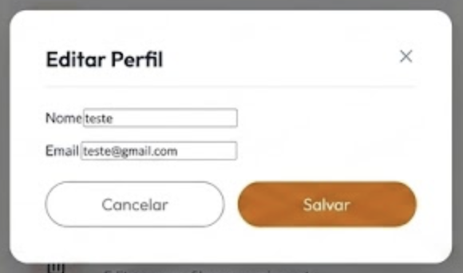
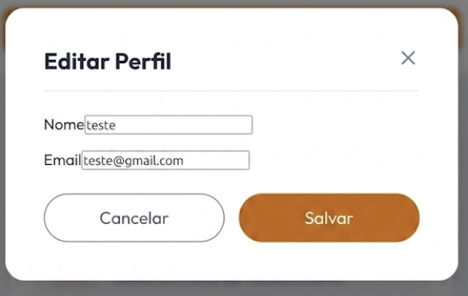
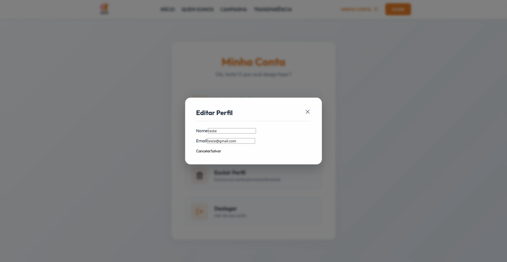
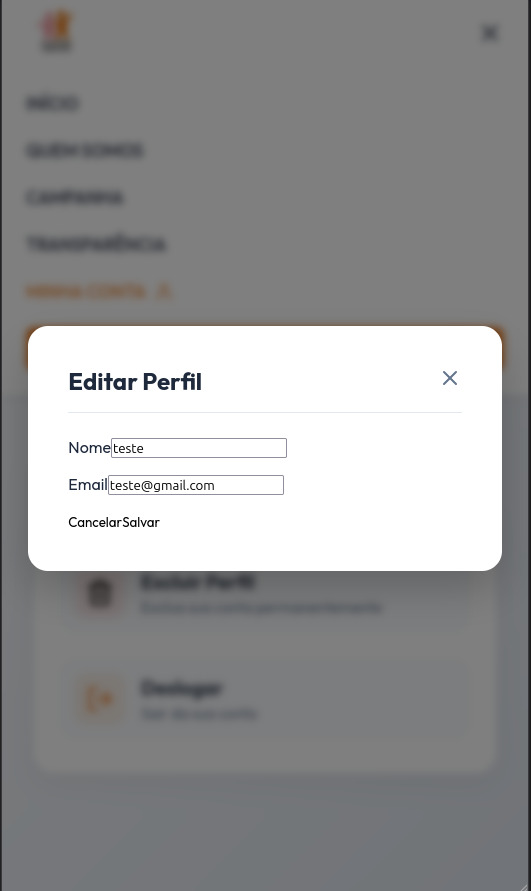

# Ciclo RAD 3 - RF04

**Período:** 01/06 a 08/06  
**Responsáveis:** [Artur Fernandes Galdino](https://github.com/ArturFGaldino), [Edson Pereira Roldao Filho](https://github.com/edso-n), [Guilherme Oliveira](https://github.com/GuilhermeOliveira1327), [Gustavo Gomes Fornaciari](https://github.com/GUGOFO), [Kaio Amoury Sasaki Acacio](https://github.com/KaioAmouryUnB), [Leonardo de Aquino Silveira Braga](https://github.com/surpesaiajin)  
**Requisitos Alocados:** [RF04 - Editar perfil](../../../13_requisitos/requisitos.md#rf04)

---

## Planejamento dos Requisitos

Neste terceiro ciclo de desenvolvimento utilizando a metodologia RAD (Rapid Application Development), a equipe planejou e executou a esteira de atualização cadastral do usuário, cobrindo o **RF04** (vinculado à **US04** do Backlog). O principal objetivo foi estender o componente de visualização (RF03) para permitir a alteração segura dos dados do voluntário:

### 1. Formulário de Edição de Perfil
Interface reativa construída sobre o modal flutuante que habilita a alteração e manipulação dos dados cadastrais:

* **Atualização Cadastral:** Permite a modificação direta do Nome Completo e do E-mail institucional do usuário logado.
* **Segurança e Redefinição:** Campos dedicados para a validação da Senha Atual e inserção sincronizada de uma Nova Senha e sua respectiva Confirmação.

---

## Design do Usuário

O processo de design buscou aproveitar a mesma estrutura sobreposta (modal) do perfil para otimizar o reaproveitamento de componentes, chave na agilidade da metodologia RAD.

Abaixo estão reservados os espaços para as visões do protótipo de edição de dados:

### Componente de Edição de Perfil(Modal)

#### Versão Desktop
{ width="40%" style="display: block; margin: 0 auto;" }

#### Versão Mobile
{ width="100" style="display: block; margin: 0 auto;" }

---

## Construção

Na fase de construção, o componente estático evoluiu para um formulário dinâmico com manipulação de estados e escopo para captura de interações do usuário, em conformidade com as telas reais geradas.

### Código Fonte
Os fontes do formulário de edição de perfil, validações de entrada e tratamento de eventos de submissão encontram-se centralizados no repositório do projeto:

**Link para o repositório/branch de desenvolvimento:** [Código Fonte da Construção - Ciclo 3](https://github.com/GUGOFO)

#### 1. Modal de Edição de Perfil Implementado

##### Versão Desktop
{ width="50%" style="display: block; margin: 0 auto;" }

##### Versão Mobile
{ width="150" style="display: block; margin: 0 auto;" }

---

## Transição

A transição cobriu os testes de fechamento alternativo (clicando fora ou no botão cancelar), a redefinição visual dos campos ao abortar a operação e a integridade de digitação das strings.

Para inspecionar o comportamento estrutural do código técnico construído, utilize o link abaixo:

**Link para análise técnica:** [Repositório de Transição - Ciclo 3](https://github.com/mdsreq-fga-unb/REQ-2026.1-T01-PortalEntreAmigos/tree/develop)

---

## Histórico de Versão

| Versão | Data | Descrição | Autor(es) | Revisor(es) |
| :---: | :---: | :--- | :---: | :---: |
| 1.0 | 15/06/2026 | Documentação inicial das fases de planejamento, design, construção e transição do RF04 |j  [Gustavo Gomes](https://github.com/GUGOFO) | Equipe |