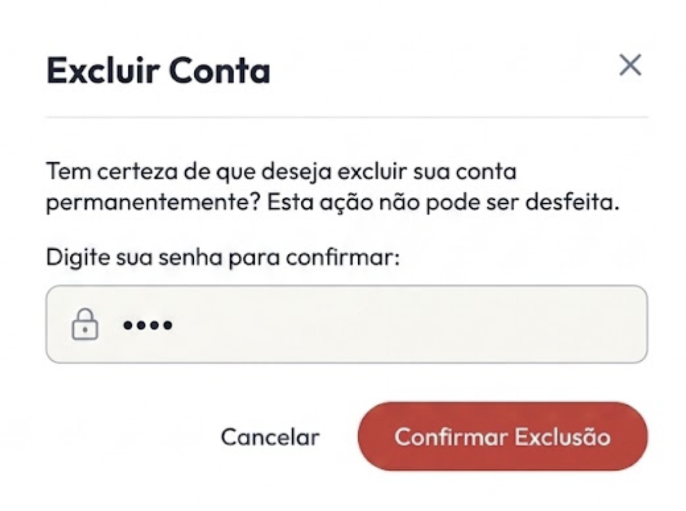
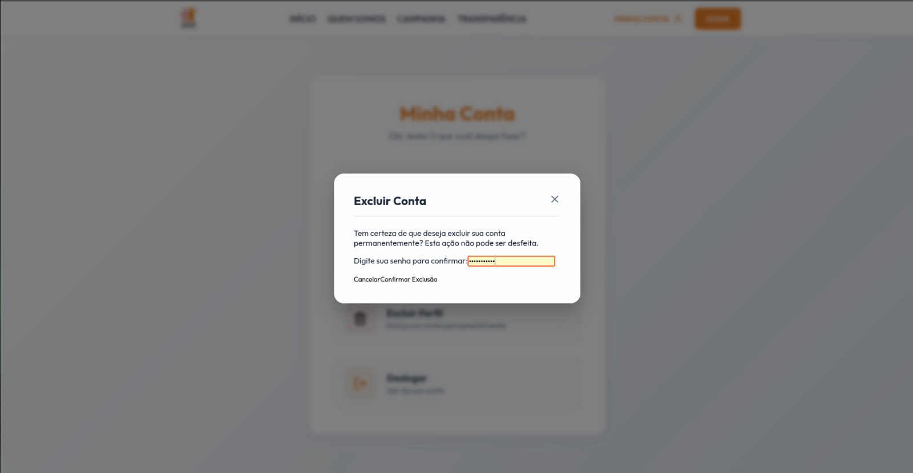
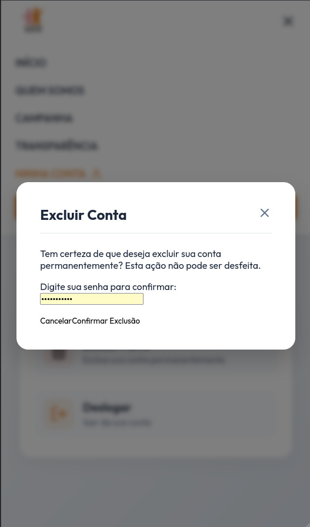

# Ciclo RAD 3 - RF05

**Período:** 01/06 a 08/06  
**Responsáveis:** [Artur Fernandes Galdino](https://github.com/ArturFGaldino), [Edson Pereira Roldao Filho](https://github.com/edso-n), [Guilherme Oliveira](https://github.com/GuilhermeOliveira1327), [Gustavo Gomes Fornaciari](https://github.com/GUGOFO), [Kaio Amoury Sasaki Acacio](https://github.com/KaioAmouryUnB), [Leonardo de Aquino Silveira Braga](https://github.com/surpesaiajin)  
**Requisitos Alocados:** [RF05 - Excluir conta](../../../13_requisitos/requisitos.md#rf05)

---

## Planejamento dos Requisitos

Neste terceiro ciclo de desenvolvimento utilizando a metodologia RAD (Rapid Application Development), a equipe planejou e executou o fluxo de encerramento e deleção de contas de usuários, cobrindo o **RF05** (vinculado à **US05** do Backlog). O principal objetivo foi garantir um mecanismo seguro, transparente e em conformidade com as diretrizes da LGPD para a remoção de voluntários da plataforma:

### 1. Fluxo de Exclusão de Conta (Modal de Confirmação)
Interface de segurança acionada a partir do painel de gerenciamento de perfil que impede deleções acidentais:

* **Dupla Confirmação:** Componente em formato modal sobreposto contendo avisos explícitos sobre o caráter permanente da ação e um campo para inserção da senha atual como validação de identidade.
* **Ações de Controle:** Disponibilização clara dos botões de controle para "Cancelar" (abortar operação) ou prosseguir com a exclusão destrutiva.

---

## Design do Usuário

O processo de design foi conduzido em estreita colaboração com o cliente, assegurando que o usuário compreenda o impacto da exclusão e tenha total controle e privacidade sobre seus dados cadastrais.

Abaixo estão reservados os espaços para as visões do protótipo de deleção de conta:

### Componente de Exclusão (Modal)

#### Versão Desktop
{ width="100%" style="display: block; margin: 0 auto;" }

#### Versão Mobile
{ width="200" style="display: block; margin: 0 auto;" }

---

## Construção

Na fase de construção, a interface estática do modal destrutivo foi codificada no frontend, implementando o estado de captura da senha de confirmação e as ações de limpeza de credenciais.

### Código Fonte
Os componentes desenvolvidos, os estilos visuais e a lógica de tratamento de eventos para o fluxo de exclusão encontram-se mapeados no repositório oficial do projeto:

**Link para o repositório/branch de desenvolvimento:** [Código Fonte da Construção - Ciclo 3](https://github.com/GUGOFO)

#### 1. Modal de Exclusão de Conta Implementado

##### Versão Desktop
{ width="100%" style="display: block; margin: 0 auto;" }

##### Versão Mobile
{ width="200" style="display: block; margin: 0 auto;" }

---

## Transição

A transição envolveu os testes de acionamento do modal a partir do painel principal, a interceptação de envios vazios e a limpeza completa das variáveis e tokens de sessão local pós-deleção simulada.

Caso queira analisar detalhadamente o comportamento estrutural do código técnico construído, acesse o link abaixo:

**Link para análise técnica:** [Repositório de Transição - Ciclo 3](https://github.com/mdsreq-fga-unb/REQ-2026.1-T01-PortalEntreAmigos/tree/develop)

---

## Histórico de Versão

| Versão | Data | Descrição | Autor(es) | Revisor(es) |
| :---: | :---: | :--- | :---: | :---: |
| 1.0 | 15/06/2026 | Documentação inicial do planejamento, design e construção do RF05 no Ciclo 3 |  [Gustavo Gomes](https://github.com/GUGOFO) | Equipe |