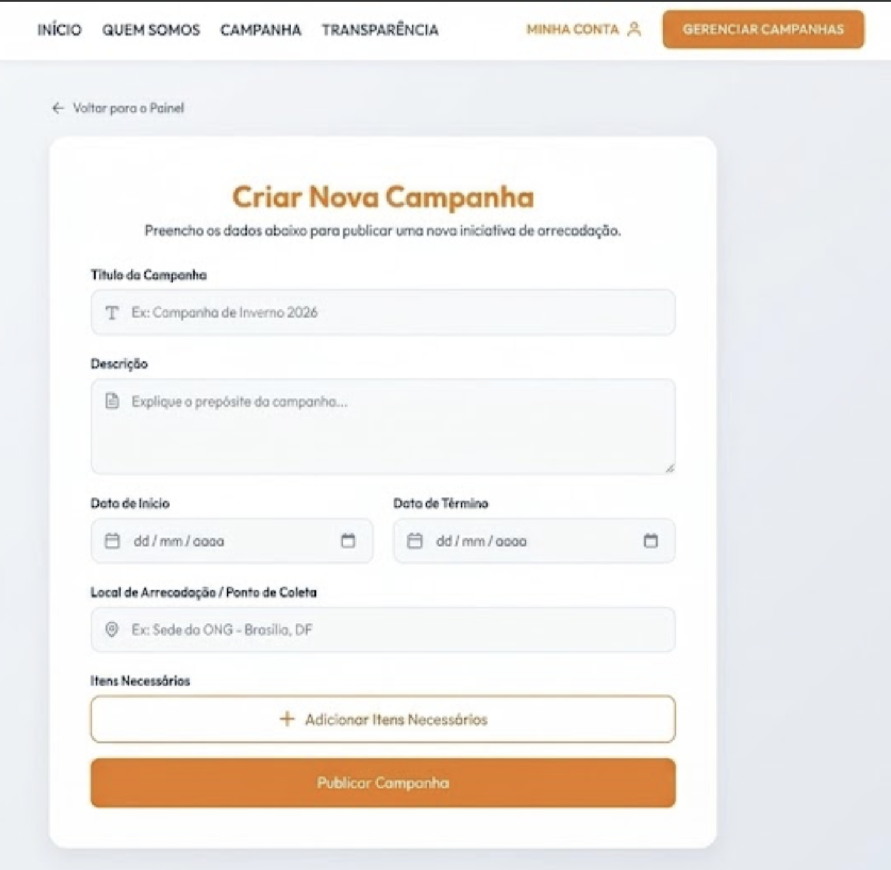
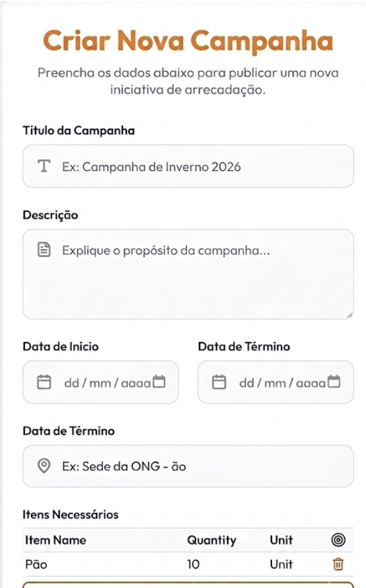
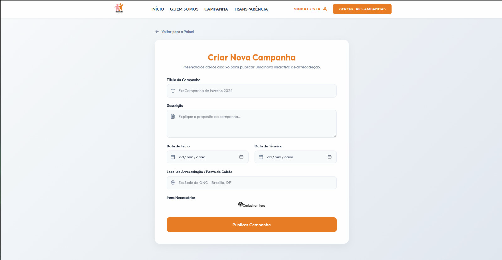
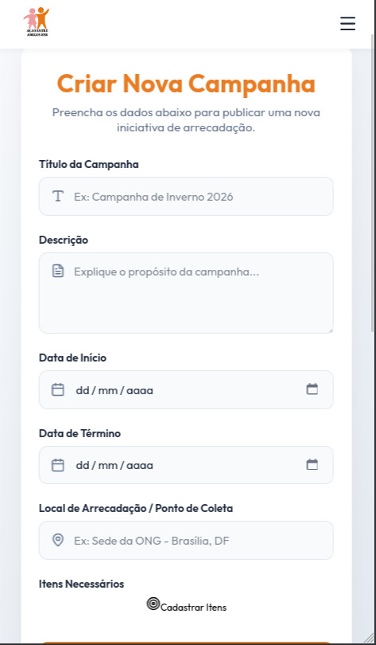

# Ciclo RAD 4 - RF06

**Período:** 08/06 a 15/06  
**Responsáveis:** [Edson Pereira Roldao Filho](https://github.com/edso-n), [Gustavo Gomes Fornaciari](https://github.com/GUGOFO), [Leonardo de Aquino Silveira Braga](https://github.com/surpesaiajin)  
**Requisitos Alocados:** [RF06 - Criar eventos](../../../13_requisitos/requisitos.md#rf06)

---

## Planejamento dos Requisitos

Neste quarto ciclo de desenvolvimento utilizando a metodologia RAD (Rapid Application Development), a equipe planejou e executou a esteira de cadastro e abertura de novas campanhas, cobrindo o **RF06** (vinculado à **US06** do Backlog). O principal objetivo foi estruturar um formulário administrativo robusto e seguro para o lançamento de novas frentes de arrecadação da ONG:

### 1. Painel de Criação de Eventos (Formulário Administrativo)
Interface de entrada de dados para que a moderação inicialize uma nova campanha na plataforma:

* **Controle de Acesso Prévio:** Bloqueio sistêmico na rota que valida se o utilizador possui o perfil de "Moderador" antes de disponibilizar o formulário ([RNF04](../../../13_requisitos/requisitos.md#rnf04)).
* **Campos Mandatórios:** Exigência de preenchimento obrigatório para dados essenciais: Título da Campanha, Descrição, Data de Início/Término, Local e Metas de Arrecadação (valores financeiros ou contagem de itens).

---

## Design do Usuário

O processo de design foi conduzido em estreita colaboração com o cliente, visando criar uma interface administrativa organizada por blocos lógicos que agilize o lançamento de novas ações beneficentes.

Abaixo estão reservados os espaços para as visões do protótipo de criação de eventos:

### Página de Criação de Evento

#### Versão Desktop
{ width="40%" style="display: block; margin: 0 auto;" }

#### Versão Mobile
{ width="100" style="display: block; margin: 0 auto;" }

---

## Construção

Nesta etapa de desenvolvimento, a equipe codificou o formulário administrativo de cadastro, estruturando as validações nativas contra campos vazios e injetando as travas de permissão de usuário no frontend.

### Código Fonte
Os componentes desenvolvidos, os estilos estruturados e as regras de obrigatoriedade de campos encontram-se mapeados no repositório oficial do projeto:

**Link para o repositório/branch de desenvolvimento:** [Código Fonte da Construção - Ciclo 4](https://github.com/GUGOFO)

#### 1. Tela de Criação de Evento Implementada

##### Versão Desktop
{ width="50%" style="display: block; margin: 0 auto;" }

##### Versão Mobile
{ width="150" style="display: block; margin: 0 auto;" }

---

## Transição

A transição compreendeu a validação do barramento de segurança para usuários não autenticados, o teste de submissão do payload de novos eventos e o comportamento responsivo dos componentes em dispositivos mobile.

Caso queira analisar detalhadamente o comportamento estrutural do código implementado, acesse o link a seguir:

**Link para análise técnica:** [Repositório de Transição - Ciclo 4](https://github.com/mdsreq-fga-unb/REQ-2026.1-T01-PortalEntreAmigos/tree/develop)

---

## Histórico de Versão

| Versão | Data | Descrição | Autor(es) | Revisor(es) |
| :---: | :---: | :--- | :---: | :---: |
| 1.0 | 22/06/2026 | Documentação inicial do planejamento, design e construção do RF06 no Ciclo 4 |  [Gustavo Gomes](https://github.com/GUGOFO) | Equipe |