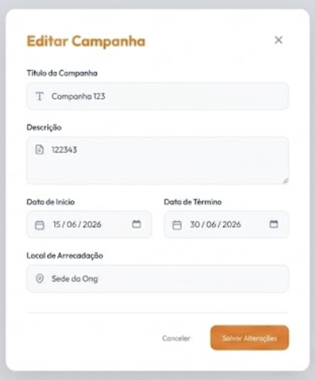
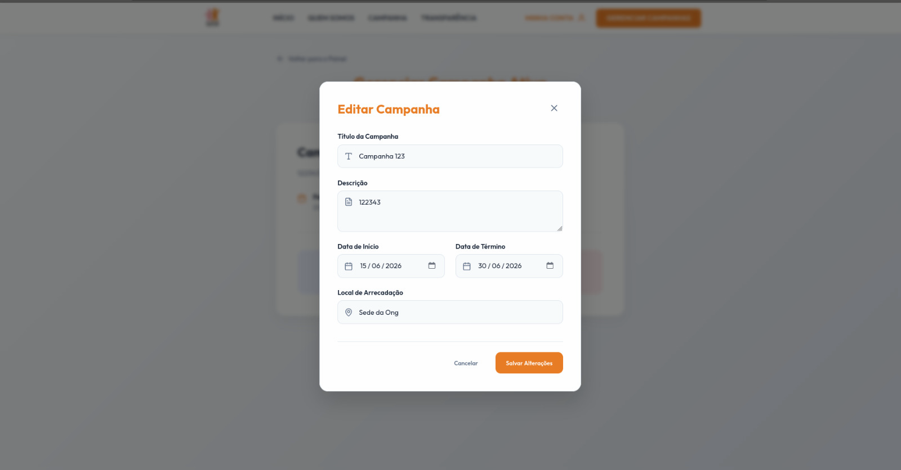
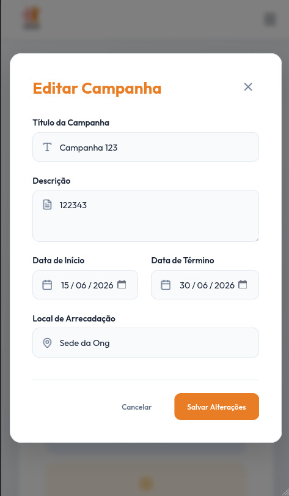

# Ciclo RAD 4 - RF07

**Período:** 08/06 a 15/06  
**Responsáveis:** [Edson Pereira Roldao Filho](https://github.com/edso-n), [Gustavo Gomes Fornaciari](https://github.com/GUGOFO), [Leonardo de Aquino Silveira Braga](https://github.com/surpesaiajin)  
**Requisitos Alocados:** [RF07 - Editar eventos](../../../13_requisitos/requisitos.md#rf07)

---

## Planejamento dos Requisitos

Neste quarto ciclo de desenvolvimento utilizando a metodologia RAD (Rapid Application Development), a equipe focou na esteira de gerenciamento e manutenção de campanhas, cobrindo o **RF07** (vinculado à **US07** do Backlog). O principal objetivo foi estruturar um fluxo administrativo intuitivo e seguro para que os moderadores corrijam dados logísticos e metas de arrecadação em andamento:

### 1. Formulário de Edição de Eventos
Painel administrativo exclusivo para a modificação dinâmica dos parâmetros de campanhas ativas:

* **Controle de Dados:** Habilita a alteração do Título da Campanha, Descrição, Data de Início/Término, Local e Metas de Arrecadação.
* **Recálculo de Indicadores:** Integração direta com o componente visual de progresso para que qualquer variação de meta de itens/valores se propague instantaneamente.

---

## Design do Usuário

O processo de design foi conduzido em estreita colaboração com o cliente, visando criar uma experiência fluida para os moderadores da ONG gerenciarem os imprevistos logísticos das arrecadações.

Abaixo estão reservados os espaços para as visões do protótipo de edição de eventos:

### Página de Edição de Evento

{ width="40%" style="display: block; margin: 0 auto;" }

---

## Construção

Nesta etapa de desenvolvimento, a equipe traduziu os requisitos planejados em código frontend funcional, estruturando os modais de entrada de dados, estados reativos e restrições de permissões administrativas.

### Código Fonte
Os componentes desenvolvidos, as folhas de estilo utilitárias e a lógica de controle de formulários encontram-se mapeados no repositório oficial do projeto:

**Link para o repositório/branch de desenvolvimento:** [Código Fonte da Construção - Ciclo 4](https://github.com/GUGOFO)

#### 1. Tela de Edição de Evento Implementada

##### Versão Desktop
{ width="50%" style="display: block; margin: 0 auto;" }

##### Versão Mobile
{ width="150" style="display: block; margin: 0 auto;" }

---

## Transição

Esta fase compreendeu o teste de preenchimento e submissão de novos dados, a validação de bloqueio de rotas para usuários não administradores e o comportamento responsivo dos componentes em múltiplas telas.

Caso queira analisar detalhadamente o comportamento estrutural do código implementado, acesse o link a seguir:

**Link para análise técnica:** [Repositório de Transição - Ciclo 4](https://github.com/mdsreq-fga-unb/REQ-2026.1-T01-PortalEntreAmigos/tree/develop)

---

## Histórico de Versão

| Versão | Data | Descrição | Autor(es) | Revisor(es) |
| :---: | :---: | :--- | :---: | :---: |
| 1.0 | 22/06/2026 | Documentação inicial do planejamento, design e construção do RF07 no Ciclo 4 |  [Gustavo Gomes](https://github.com/GUGOFO) | Equipe |