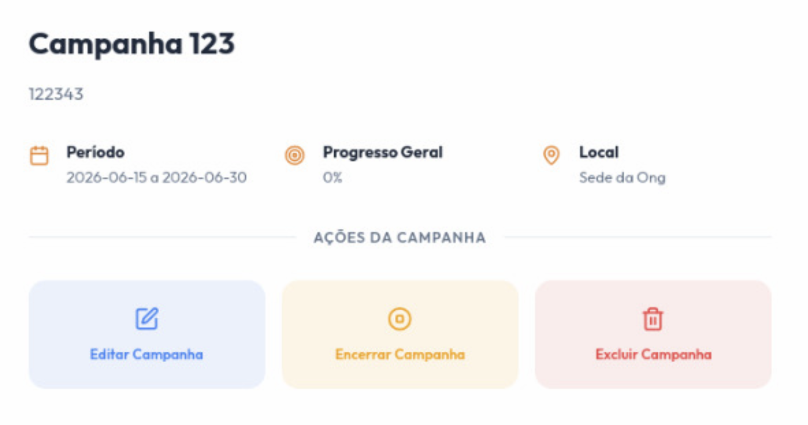
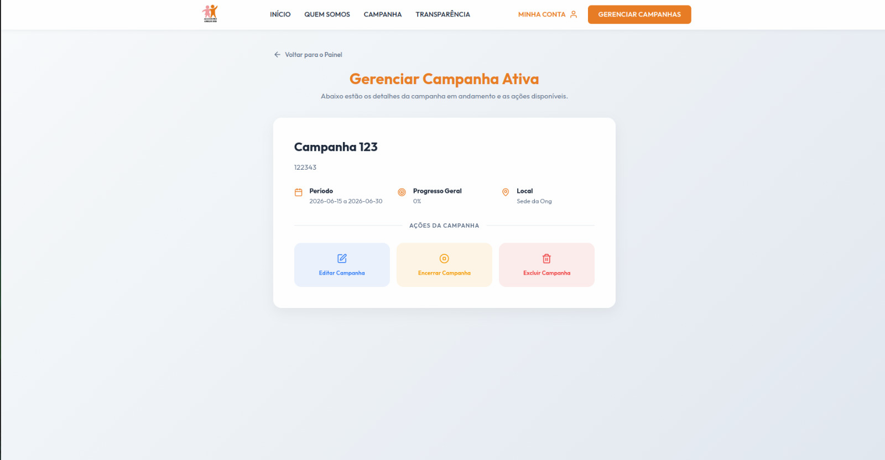
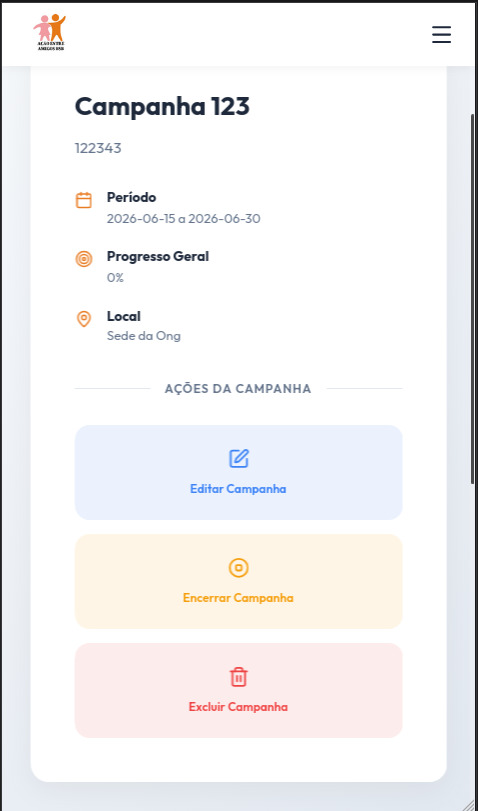

# Ciclo RAD 4 - RF08

**Período:** 08/06 a 15/06  
**Responsáveis:** [Edson Pereira Roldao Filho](https://github.com/edso-n), [Gustavo Gomes Fornaciari](https://github.com/GUGOFO), [Leonardo de Aquino Silveira Braga](https://github.com/surpesaiajin)  
**Requisitos Alocados:** [RF08 - Excluir eventos](../../../13_requisitos/requisitos.md#rf08)

---

## Planejamento dos Requisitos

Neste quarto ciclo de desenvolvimento utilizando a metodologia RAD (Rapid Application Development), a equipe focou na esteira de expurgo e controle de integridade de campanhas, cobrindo o **RF08** (vinculado à **US08** do Backlog). O principal objetivo foi estruturar as regras de negócio administrativas para remoção de eventos criados indevidamente ou cancelados, protegendo o histórico financeiro da ONG:

### 1. Mecanismos de Deleção e Inativação de Eventos
Interface administrativa acionada a partir do gerenciamento de eventos que bifurca o comportamento do sistema com base no histórico da campanha:

* **Exclusão Física (Sem Histórico):** Permite a deleção definitiva e permanente do banco de dados caso o evento não possua doações vinculadas ou inscrições ativas.
* **Inativação Lógica (Com Histórico):** Caso o evento já possua registros vinculados, o sistema trava o expurgo definitivo e habilita apenas a mudança de status para "Cancelado/Inativo", preservando os dados para prestação de contas.

---

## Design do Usuário

O processo de design foi conduzido em estreita colaboração com o cliente, definindo modais de alerta claros para evitar ações acidentais e garantir conformidade com as regras de governança de dados da entidade.

Abaixo estão reservados os espaços para as visões do protótipo de exclusão/inativação de eventos:

### Componente de Exclusão de Evento (Modal)

#### Versão Desktop
{ width="40%" style="display: block; margin: 0 auto;" }

---

## Construção

Nesta etapa de desenvolvimento, a equipe traduziu os requisitos planejados em código funcional no frontend, implementando os modais de confirmação crítica e as checagens estáticas de dependências de dados.

### Código Fonte
Os componentes desenvolvidos, as folhas de estilo utilitárias e a lógica de tratamento de eventos para exclusão encontram-se mapeados no repositório oficial do projeto:

**Link para o repositório/branch de desenvolvimento:** [Código Fonte da Construção - Ciclo 4](https://github.com/GUGOFO)

#### 1. Tela de Exclusão de Evento Implementada

##### Versão Desktop
{ width="50%" style="display: block; margin: 0 auto;" }

##### Versão Mobile
{ width="150" style="display: block; margin: 0 auto;" }

---

## Transição

Esta fase compreendeu os testes de acionamento do gatilho destrutivo, a simulação de tentativa de exclusão em blocos contendo histórico e a verificação das travas de segurança para usuários comuns.

Caso queira analisar detalhadamente o comportamento estrutural do código implementado, acesse o link a seguir:

**Link para análise técnica:** [Repositório de Transição - Ciclo 4](https://github.com/GUGOFO)

---

## Histórico de Versão

| Versão | Data | Descrição | Autor(es) | Revisor(es) |
| :---: | :---: | :--- | :---: | :---: |
| 1.0 | 22/06/2026 | Documentação inicial do planejamento, design e construção do RF08 no Ciclo 4 |  [Gustavo Gomes](https://github.com/GUGOFO)| Equipe |