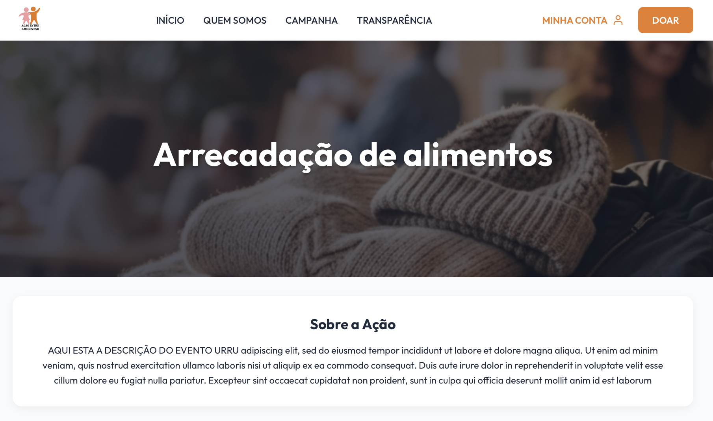

# Ciclo RAD 5 - RF10

**Período:** 08/06 a 15/06  
**Responsáveis:** [Artur Fernandes Galdino](https://github.com/ArturFGaldino), [Guilherme Oliveira](https://github.com/GuilhermeOliveira1327), [Kaio Amoury](https://github.com/KaioAmouryUnB) e [Gustavo Gomes Fornaciari](https://github.com/GUGOFO)  
**Requisitos Alocados:** [RF10 - Exibir progresso da meta](../../../13_requisitos/requisitos.md#rf10)

---

## Planejamento dos Requisitos

Neste quinto ciclo de desenvolvimento utilizando a metodologia RAD (Rapid Application Development), a equipe focou na visualização do andamento das campanhas ativas, cobrindo o **RF10** (vinculado à **US10** do Backlog). O principal objetivo foi permitir que voluntários e visitantes acompanhem, em tempo real, o quanto já foi arrecadado em relação à meta definida:

### 1. Gráfico de Distribuição das Doações
Componente visual que apresenta a proporção de cada item arrecadado na campanha:

* **Gráfico de Pizza:** Exibição da distribuição percentual entre os itens solicitados (ex.: arroz, feijão e cobertores).
* **Legenda Interativa:** Identificação visual por cores para facilitar a leitura dos dados.

### 2. Progresso Global da Campanha
Indicador consolidado do avanço geral da arrecadação:

* **Gráfico Circular:** Representação da porcentagem concluída da meta total da campanha.
* **Atualização Dinâmica:** Recálculo dos indicadores quando novos registros de doação são processados ([RNF06](../../../13_requisitos/requisitos.md#rnf06)).

---

## Design do Usuário

O processo de design foi conduzido em colaboração com o cliente, priorizando clareza visual e leitura rápida dos indicadores de arrecadação na página da campanha ativa.

Abaixo estão os protótipos elaborados para este ciclo:

### Página da Campanha Ativa — Indicadores de Progresso

#### Versão Desktop
{ width="60%" style="display: block; margin: 0 auto;" }

#### Versão Mobile
{ width="200" style="display: block; margin: 0 auto;" }

---

## Construção

Nesta etapa, a equipe implementou os componentes de visualização de dados na página da campanha ativa, utilizando biblioteca de gráficos para renderizar a distribuição das doações e o progresso global.

### Código Fonte
Os componentes de gráficos, estilos e integração com os dados da campanha encontram-se mapeados no repositório oficial do projeto:

**Link para o repositório/branch de desenvolvimento:** [Código Fonte da Construção - Ciclo 5](https://github.com/mdsreq-fga-unb/REQ-2026.1-T01-PortalEntreAmigos/tree/develop)

#### 1. Gráficos de Progresso Implementados

##### Versão Desktop
{ width="100%" style="display: block; margin: 0 auto;" }

##### Versão Mobile
{ width="200" style="display: block; margin: 0 auto;" }

---

## Transição

Esta fase compreendeu a validação da renderização responsiva dos gráficos, a verificação da atualização dos percentuais após novas doações e a preparação da integração com o RF11.

Caso queira analisar detalhadamente o comportamento estrutural do código implementado, acesse o link a seguir:

**Link para análise técnica:** [Repositório de Transição - Ciclo 5](https://github.com/mdsreq-fga-unb/REQ-2026.1-T01-PortalEntreAmigos/tree/develop)

---

## Histórico de Versão

| Versão | Data | Descrição | Autor(es) | Revisor(es) |
| :---: | :---: | :--- | :---: | :---: |
| 1.0 | 15/06/2026 | Documentação do planejamento, design e construção do RF10 no Ciclo RAD 5 | [Artur Fernandes Galdino](https://github.com/ArturFGaldino), [Guilherme Oliveira](https://github.com/GuilhermeOliveira1327), [Kaio Amoury](https://github.com/KaioAmouryUnB), [Gustavo Gomes Fornaciari](https://github.com/GUGOFO) | Equipe |
