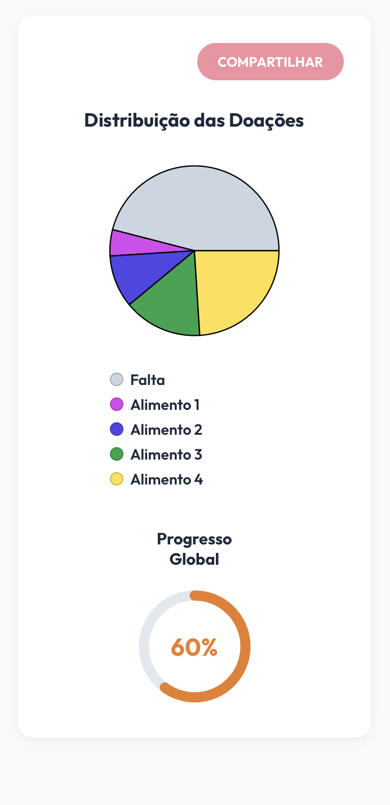

# Ciclo RAD 5 - RF12

**Período:** 08/06 a 15/06  
**Responsáveis:** [Artur Fernandes Galdino](https://github.com/ArturFGaldino), [Guilherme Oliveira](https://github.com/GuilhermeOliveira1327) e [Kaio Amoury Sasaki Acacio](https://github.com/KaioAmouryUnB)  
**Requisitos Alocados:** [RF12 - Atualizar saldo](../../../13_requisitos/requisitos.md#rf12)

---

## Planejamento dos Requisitos

Neste quinto ciclo de desenvolvimento utilizando a metodologia RAD (Rapid Application Development), a equipe implementou a atualização do saldo de itens arrecadados na campanha, cobrindo o **RF12** (vinculado à **US12** do Backlog). O principal objetivo foi manter o estoque digital alinhado às entregas físicas e refletir essas mudanças nos indicadores visuais:

### 1. Atualização do Saldo por Item
Controle da quantidade arrecadada de cada suprimento:

* **Indicadores por Item:** Exibição do formato "X / Y kg arrecadado" para cada item da campanha.
* **Recálculo Automático:** Atualização dos valores exibidos após confirmação de novas doações.

### 2. Reflexo nos Gráficos de Progresso
Sincronização entre saldo atualizado e visualizações da campanha:

* **Gráfico de Pizza:** Redistribuição proporcional conforme novos itens entram no saldo.
* **Progresso Global:** Recálculo da porcentagem total da meta da campanha ([RNF04](../../../13_requisitos/requisitos.md#rnf04)).

---

## Design do Usuário

O processo de design manteve consistência visual com os demais componentes da página da campanha ativa, garantindo que as atualizações de saldo fossem perceptíveis de forma imediata.

Abaixo estão os protótipos elaborados para este ciclo:

### Página da Campanha Ativa — Saldo Atualizado

#### Versão Desktop
{ width="60%" style="display: block; margin: 0 auto;" }

#### Versão Mobile
{ width="200" style="display: block; margin: 0 auto;" }

---

## Construção

Nesta etapa, a equipe implementou a lógica de atualização de saldo e sua propagação para os gráficos de distribuição e progresso global da campanha.

### Código Fonte
A lógica de atualização de saldo, estados reativos e integração com os gráficos encontram-se mapeados no repositório oficial do projeto:

**Link para o repositório/branch de desenvolvimento:** [Código Fonte da Construção - Ciclo 5](https://github.com/mdsreq-fga-unb/REQ-2026.1-T01-PortalEntreAmigos/tree/develop)

#### 1. Saldo e Gráficos Atualizados

##### Versão Desktop
{ width="100%" style="display: block; margin: 0 auto;" }

##### Versão Mobile
{ width="200" style="display: block; margin: 0 auto;" }

---

## Transição

Esta fase compreendeu a validação do recálculo dos indicadores após alterações de saldo, testes de consistência entre os dados exibidos e a preparação para integração com o fluxo de confirmação de recebimento (RF13).

Caso queira analisar detalhadamente o comportamento estrutural do código implementado, acesse o link a seguir:

**Link para análise técnica:** [Repositório de Transição - Ciclo 5](https://github.com/mdsreq-fga-unb/REQ-2026.1-T01-PortalEntreAmigos/tree/develop)

---

## Histórico de Versão

| Versão | Data | Descrição | Autor(es) | Revisor(es) |
| :---: | :---: | :--- | :---: | :---: |
| 1.0 | 15/06/2026 | Documentação do planejamento, design e construção do RF12 no Ciclo RAD 5 | [Kaio Amoury](https://github.com/KaioAmouryUnB) | Equipe |
