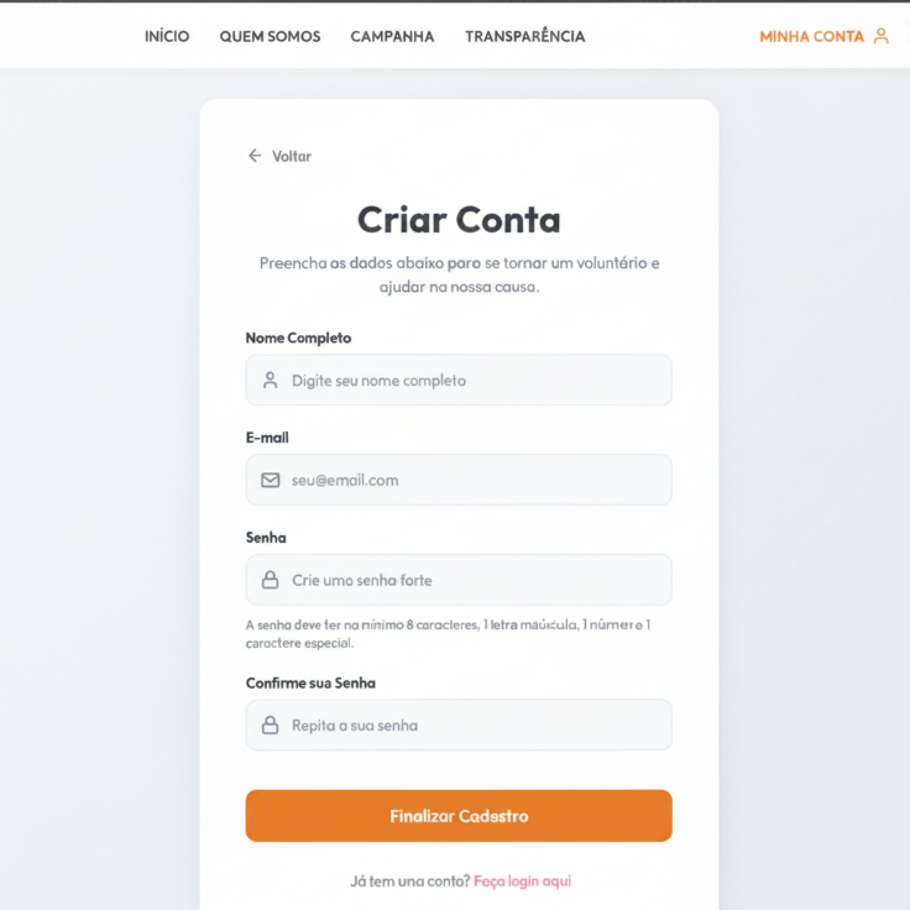

# [US01](mvp.md)
> **Como voluntário, quero cadastrar a minha conta, para conseguir realizar promessas de doação e registrar o meu histórico.**

---

### Critérios de Aceitação

| ID | Critério de Aceite | Status |
| :--- | :--- | :---: |
| **CA01** | Solicitar campos obrigatórios: Nome Completo, E-mail, Senha e Confirmação de Senha. | ✔ Sim |
| **CA02** | O sistema não deve permitir o cadastro de um e-mail já existente na base de dados. | ✔ Sim |
| **CA03** | A senha deve ter no mínimo 8 caracteres, contendo maiúscula, número e caractere especial. | ✔ Sim |
| **CA04** | A senha deve ser criptografada antes de ser salva no banco de dados (RNF03). | ✔ Sim |

---

### Definição de Preparado (DoR)

| Item de Verificação | Evidência / Rastreabilidade | Situação |
| :--- | :--- | :---: |
| Informação necessária para o trabalho? | Critérios de complexidade de senha e campos obrigatórios do formulário definidos. | ✔ Sim |
| Representado por história de usuário? | Mapeado explicitamente na US01 no Backlog do Produto. | ✔ Sim |
| Coberto por critérios de aceite? | Critérios estruturados e documentados na página de Critérios de Aceitação. | ✔ Sim |
| Mapeado para um protótipo? | Estrutura de inputs e feedbacks visuais planejada e alinhada com o projeto. | ✔ Sim |
| Protótipo validado pelo cliente? | Fluxo de captura de dados validado junto à coordenação da ONG. | ✔ Sim |
| Coerente com a prioridade definida? | Classificado como CP7, sendo um requisito estrutural básico para gestão de usuários. | ✔ Sim |
| Cabe em uma Iteração? | Escopo das validações de frontend executado entre os dias 09/06 e 15/06. | ✔ Sim |

---

### Definição de Pronto (DoD)

| Pergunta Fundamental | Evidência de Implementação | Status |
| :--- | :--- | :---: |
| Entrega um incremento do produto? | Componentes da página "Criar Conta" codificados com tratamento de estados ativos. | ✔ Sim |
| Coerente com o protótipo validado? | O layout final reflete estritamente a disposição dos campos de texto e botões. | ✔ Sim |
| Contempla os critérios de aceite? | Validados e revisados sem impedimentos pendentes no arquivo de checagem. | ✔ Sim |
| Testes unitários/integração aprovados? | Testes de validação de string (Regex de senha forte e igualdade) executados. | ✔ Sim |
| Revisada e validada pela equipe? | Homologada em ambiente de teste local e validada em reunião de revisão de iteração. | ✔ Sim |
| Documentação técnica atualizada? | Mapeamento de artefatos atualizado e histórico de versão sincronizado. | ✔ Sim |

---

### Prototipagem

  
  

---

### Construção & Acesso

#### Página de Cadastro

* **Link para o sistema real:** [Acessar Portal Entre Amigos](https://github.com/mdsreq-fga-unb/REQ-2026.1-T01-PortalEntreAmigos.git)
* **Fluxo de Acesso:**
    1. Acesse a página inicial da aplicação.
    2. Clique no botão **"Cadastrar"** ou **"Criar Conta"** localizado no menu superior direito.
    3. Preencha todos os campos obrigatórios do formulário (*Nome Completo, E-mail, Senha e Confirmação de Senha*).
    4. Clique no botão de submissão para concluir o registro.

#### Rastreabilidade de Código
* **Código de produção homologado:** [Repositório Principal (Branch Main)](https://github.com/mdsreq-fga-unb/REQ-2026.1-T01-PortalEntreAmigos/tree/main)