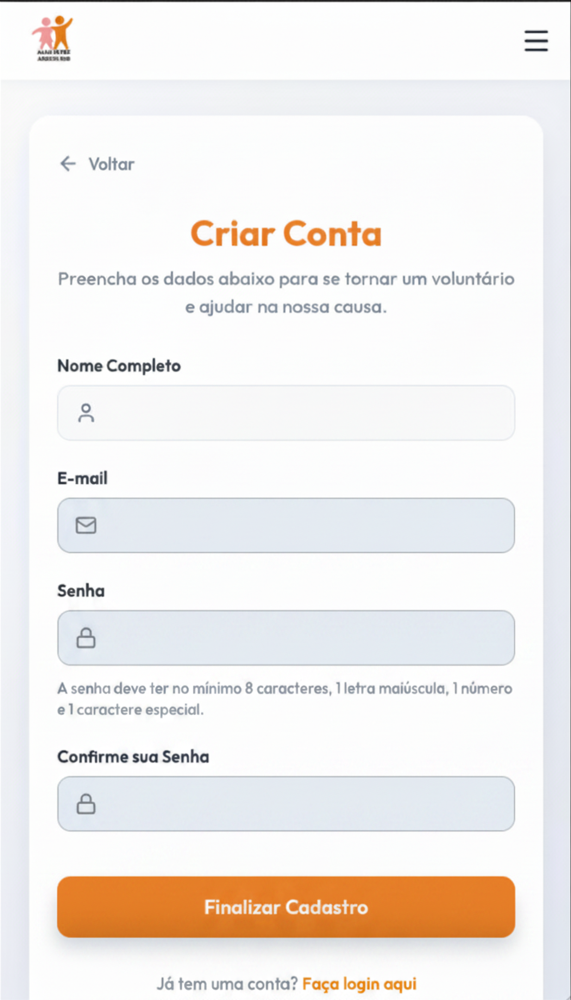

# [US01](mvp.md)
> **Como voluntário, quero cadastrar a minha conta, para conseguir realizar promessas de doação e registrar o meu histórico.**

---

### Critérios de Aceitação

| ID | Critério de Aceite | Status |
| :--- | :--- | :---: |
| **CA01** | Solicitar campos obrigatórios: Nome Completo, E-mail, Senha e Confirmação de Senha. | completo |
| **CA02** | O sistema não deve permitir o cadastro de um e-mail já existente na base de dados. | completo |
| **CA03** | A senha deve ter no mínimo 8 caracteres, contendo maiúscula, número e caractere especial. | completo |
| **CA04** | A senha deve ser criptografada antes de ser salva no banco de dados ([RNF03](../../13_requisitos/requisitos.md#rnf03)). | completo |

---

### Definição de Preparado (DoR)

| Item de Verificação | Evidência / Rastreabilidade | Situação |
| :--- | :--- | :---: |
| Informação necessária para o trabalho? | Os critérios de complexidade de senha e os campos obrigatórios do formulário foram definidos. | completo |
| Representado por história de usuário? | Mapeado explicitamente na US01 no Backlog do Produto. | completo |
| Coberto por critérios de aceite? | Critérios estruturados e documentados na página de Critérios de Aceitação. | completo |
| Mapeado para um protótipo? | Estrutura de inputs e feedbacks visuais planejada e alinhada com a identidade do projeto. | completo |
| Protótipo validado pelo cliente? | Fluxo de captura de dados de voluntários validado junto à coordenação da ONG. | completo |
| Coerente com a prioridade definida? | Classificado como CP7, sendo um requisito estrutural básico para a gestão de usuários. | completo |
| Cabe em uma Iteração? | O escopo das validações de frontend foi perfeitamente executado dentro do período de 01/06 a 08/06. | completo |

---

### Definição de Pronto (DoD)

| Pergunta Fundamental do DoD | Evidência de Implementação | Situação |
| :--- | :--- | :---: |
| **Entrega um incremento do produto?** | Componentes da página "Criar Conta" codificados com tratamento de estados e mensagens de erro ativos. | completo |
| **A entrega está coerente com o protótipo?** | O layout final reflete estritamente a disposição dos campos de texto, botão de finalização e links de alternância. | completo |
| **Contempla os critérios de aceite estabelecidos?** | Validados e revisados sem impedimentos pendentes no arquivo de checagem local. | completo |
| **Todos os testes unitários e de integração foram aprovados?** | Testes de validação de string (Regex de senha forte e checagem de igualdade) executados com sucesso. | completo |
| **A entrega foi revisada e validada pela equipe?** | Homologada em ambiente de teste local e validada pela equipe para autorizar a consolidação na branch principal. | completo |
| **A documentação técnica foi revisada e atualizada?** | Mapeamento de artefatos de cadastro atualizado e histórico de versão sincronizado no repositório. | completo |

---

### Prototipagem

  
  

---

### Construção & Acesso

#### Página de Cadastro

* **Link para o sistema real:** [Acessar Portal Entre Amigos](https://github.com/mdsreq-fga-unb/REQ-2026.1-T01-PortalEntreAmigos.git)
* **Fluxo de Acesso:**
    1. Acesse a página inicial da aplicação.
    2. Clique no botão **"Cadastrar"** ou **"Criar Conta"** localizado no menu superior direito.
    3. Preencha todos os campos obrigatórios do formulário (*Nome Completo, E-mail, Senha e Confirmação de Senha*).
    4. Clique no botão de submissão para concluir o registro.

#### Rastreabilidade de Código
* **Código de produção homologado:** [Repositório Principal (Branch Main)](https://github.com/mdsreq-fga-unb/REQ-2026.1-T01-PortalEntreAmigos/tree/main)