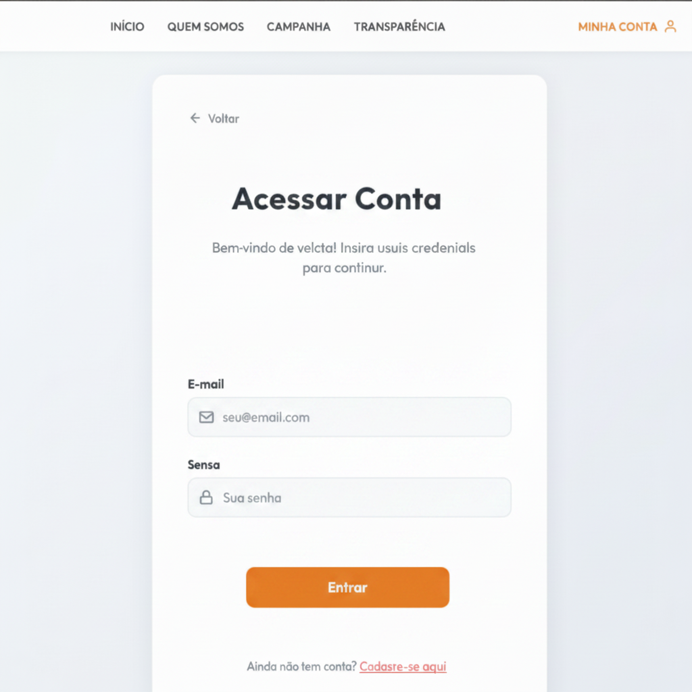
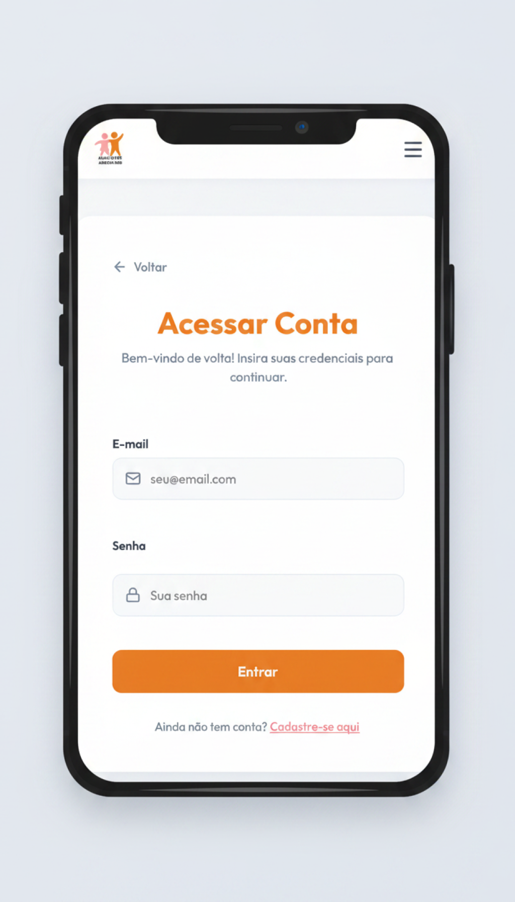

# [US02](mvp.md)
> **Como usuário, quero realizar o login, para acessar meu perfil com segurança na plataforma.**

---

### Critérios de Aceitação

| ID | Critério de Aceite | Status |
| :--- | :--- | :---: |
| **CA01** | O utilizador deve fornecer um e-mail válido e a senha correspondente para acessar o sistema. | completo |
| **CA02** | Caso as credenciais estejam incorretas, o sistema deve exibir uma mensagem de erro genérica (ex: "E-mail ou senha incorretos"). | completo |

---

### Definição de Preparado (DoR)

| Item de Verificação | Evidência / Rastreabilidade | Situação |
| :--- | :--- | :---: |
| Informação necessária para o trabalho? | As regras de validação de formato e o escopo de mensagens de erro genéricas foram alinhados. | completo |
| Representado por história de usuário? | Mapeado explicitamente na US02 no Backlog do Produto. | completo |
| Coberto por critérios de aceite? | Critérios estruturados e documentados na página de Critérios de Aceitação. | completo |
| Mapeado para um protótipo? | Estrutura de caixas de login e botões de ação mapeada na interface global. | completo |
| Protótipo validado pelo cliente? | Fluxo de autenticação de voluntários e moderadores validado com a coordenação da ONG. | completo |
| Coerente com a prioridade definida? | Classificado como CP7, sendo um requisito básico essencial para as permissões de acesso. | completo |
| Cabe em uma Iteração? | O escopo do frontend estático foi planejado e executado dentro do período de 01/06 a 08/06. | completo |

---

### Definição de Pronto (DoD)

| Pergunta Fundamental do DoD | Evidência de Implementação | Situação |
| :--- | :--- | :---: |
| **Entrega um incremento do produto?** | Componentes da página "Acessar Conta" codificados com controle de login e feedbacks visuais funcionais. | completo |
| **A entrega está coerente com o protótipo?** | O layout real reflete com fidelidade a disposição dos inputs de login, botões e redirecionamentos. | completo |
| **Contempla os critérios de aceite estabelecidos?** | Validados e revisados sem impedimentos pendentes no arquivo de checagem local. | completo |
| **Todos os testes unitários e de integração foram aprovados?** | Testes de controle de formulário e checagem de obrigatoriedade de campos aprovados. | completo |
| **A entrega foi revisada e validada pela equipe?** | Homologada em ambiente local e revisada pelo grupo para autorizar a unificação das branches. | completo |
| **A documentação técnica foi revisada e atualizada?** | Mapeamento de artefatos de login atualizado e histórico de versão sincronizado no repositório. | completo |

---

### Prototipagem

  
  

---

### Construção & Acesso

#### Página de Login

* **Link para o sistema real:** [Acessar Portal Entre Amigos](https://req-2026-1-t01-portalentreamigos-1.onrender.com)
* **Fluxo de Acesso:**
    1. Acesse a página inicial da aplicação.
    2. Clique no botão **"Entrar"** ou **"Login"** localizado no menu superior direito.
    3. Preencha os campos obrigatórios do formulário (*E-mail e Senha*).
    4. Clique no botão de submissão para concluir a autenticação e acessar o sistema.

#### Rastreabilidade de Código
* **Código de produção homologado:** [Repositório Principal (Branch Main)](https://github.com/mdsreq-fga-unb/REQ-2026.1-T01-PortalEntreAmigos/tree/main)