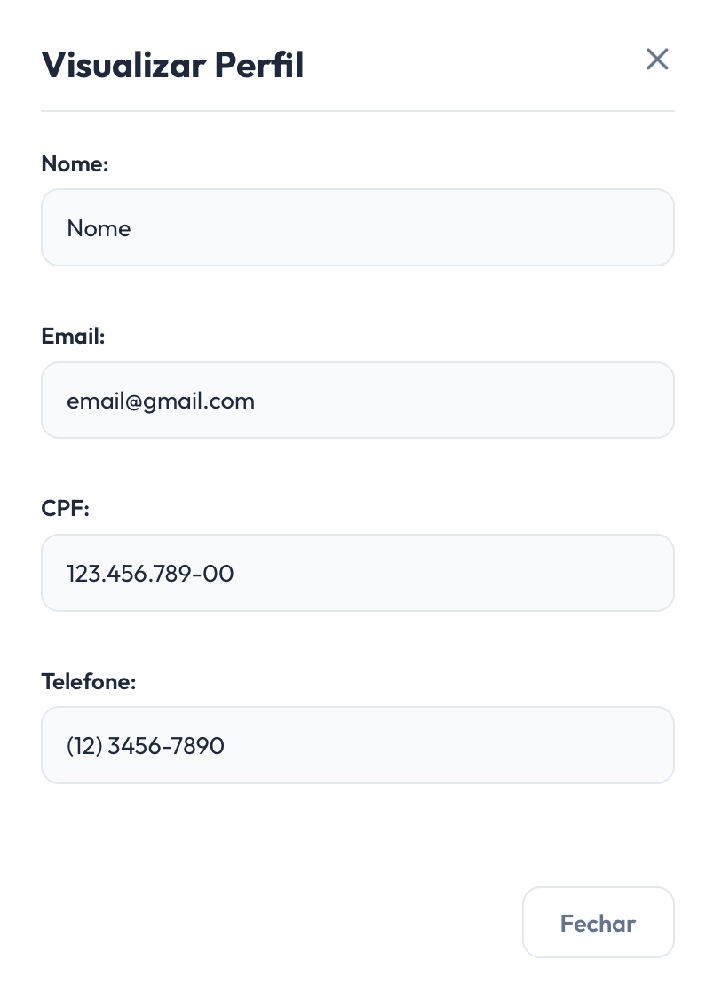

# [US03](mvp.md)
> **Como voluntário, quero visualizar o meu perfil, para que eu possa ver meus dados cadastrados.**

---

### Critérios de Aceitação

| ID | Critério de Aceite | Status |
| :--- | :--- | :---: |
| **CA01** | A página de perfil deve exibir os dados pessoais do usuário (Nome Completo e E-mail). | completo |
| **CA02** | A visualização deve se adaptar perfeitamente a telas de dispositivos móveis (smartphones e tablets) e desktops ([RNF01](../../13_requisitos/requisitos.md#rf01)). | completo |

---

### Definição de Preparado (DoR)

| Item de Verificação | Evidência / Rastreabilidade | Situação |
| :--- | :--- | :---: |
| Informação necessária para o trabalho? | As informações mínimas de exibição (Nome e E-mail) foram mapeadas com a organização. | completo |
| Representado por história de usuário? | Mapeado explicitamente na US03 no Backlog do Produto. | completo |
| Coberto por critérios de aceite? | Critérios estruturados e documentados na página de Critérios de Aceitação. | completo |
| Mapeado para um protótipo? | Disposição do modal flutuante e fechamento mapeados adequadamente. | completo |
| Protótipo validado pelo cliente? | Fluxo de visualização rápida validado junto à coordenação da ONG Ação Entre Amigos BSB. | completo |
| Coerente com a prioridade definida? | Classificado como CP6, possuindo alta relevância para a ambientação do voluntário. | completo |
| Cabe em uma Iteração? | O escopo de exibição e estilização frontend foi planejado e executado dentro do período de 01/06 a 08/06. | completo |

---

### Definição de Pronto (DoD)

| Pergunta Fundamental do DoD | Evidência de Implementação | Situação |
| :--- | :--- | :---: |
| **Entrega um incremento do produto?** | Componente do modal de perfil implementado com exibição correta das variáveis locais. | completo |
| **A entrega está coerente com o protótipo?** | O layout reflete fielmente o posicionamento do modal centralizado e os rótulos textuais. | completo |
| **Contempla os critérios de aceite estabelecidos?** | Validados e revisados sem impedimentos pendentes no arquivo de checagem local. | completo |
| **Todos os testes unitários e de integração foram aprovados?** | Testes de gatilho (abrir/fechar) e renderização das caixas textuais validados. | completo |
| **A entrega foi revisada e validada pela equipe?** | Homologada em ambiente local e revisada pelo grupo para autorizar o merge unificado. | completo |
| **A documentação técnica foi revisada e atualizada?** | Histórico de artefatos consolidado e controle de versão sincronizado no repositório. | completo |

---

### Prototipagem

  
  

---

### Construção & Acesso

#### Painel de Informações do Usuário

* **Link para o sistema real:** [Acessar Portal Entre Amigos](https://github.com/mdsreq-fga-unb/REQ-2026.1-T01-PortalEntreAmigos.git)
* **Fluxo de Acesso:**
    1. Acesse a página inicial da aplicação e certifique-se de estar autenticado no sistema.
    2. Clique no ícone ou botão de perfil localizado no menu superior da barra de navegação.
    3. Um modal flutuante sobreposto será renderizado na tela, exibindo claramente o *Nome Completo e o E-mail* vinculados à conta ativa.
    4. Utilize o botão de fechar para ocultar o modal e retornar ao fluxo de navegação principal.

#### Rastreabilidade de Código
* **Código de produção homologado:** [Repositório Principal (Branch Main)](https://github.com/mdsreq-fga-unb/REQ-2026.1-T01-PortalEntreAmigos/tree/main)