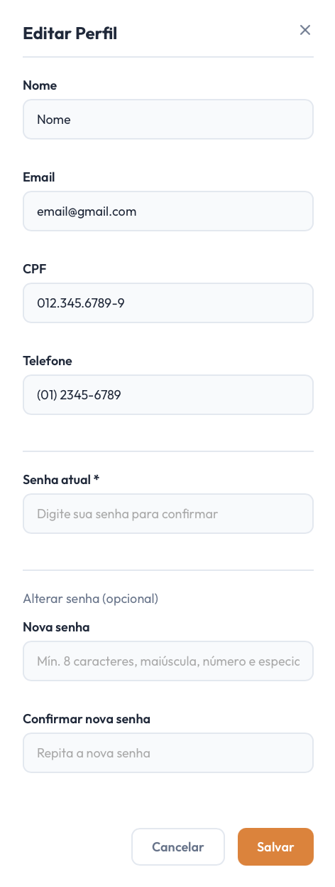

# [US04](mvp.md)
> **Como voluntário, quero editar o meu perfil, para manter as minhas informações de contato atualizadas para a ONG.**

---

### Critérios de Aceitação

| ID | Critério de Aceite | Status |
| :--- | :--- | :---: |
| **CA01** | O voluntário deve poder alterar seu Nome, Senha, email, CPF e Telefone. | completo |
| **CA02** | Caso o voluntario tente atualizar para um email ou CPF ja existente, deve ocorrer uma mensagem de erro. | completo |
| **CA03** | O sistema deve pedir a senha atual para confirmar a alteração. | completo |
| **CA03** | As alterações devem refletir imediatamente no banco de dados e na interface do usuário ([RNF07](../../13_requisitos/requisitos.md#rf07)). | completo |

---

### Definição de Preparado (DoR)

| Item de Verificação | Evidência / Rastreabilidade | Situação |
| :--- | :--- | :---: |
| Informação necessária para o trabalho? | Mapeamento dos campos editáveis (Nome, E-mail, Senhas) validado em conjunto com a organização. | completo |
| Representado por história de usuário? | Mapeado explicitamente na US04 no Backlog do Produto. | completo |
| Coberto por critérios de aceite? | Critérios estruturados e documentados na página de Critérios de Aceitação. | completo |
| Mapeado para um protótipo? | Disposição dos inputs e botões de ação ("Salvar" e "Cancelar") modelados previamente. | completo |
| Protótipo validado pelo cliente? | Fluxo de edição rápida em modal validado junto à coordenação da ONG Ação Entre Amigos BSB. | completo |
| Coerente com a prioridade definida? | Classificado como CP6, possuindo alta relevância para a autonomia cadastral do voluntário. | completo |
| Cabe em uma Iteração? | O escopo de manipulação de formulário e controle de estados frontend foi executado de forma enxuta entre 01/06 a 08/06. | completo |

---

### Definição de Pronto (DoD)

| Pergunta Fundamental do DoD | Evidência de Implementação | Situação |
| :--- | :--- | :---: |
| **Entrega um incremento do produto?** | Componentes do formulário de edição implementado com controle de estado ativo nos inputs. | completo |
| **A entrega está coerente com o protótipo?** | O layout reflete fielmente o posicionamento centralizado do modal e as caixas de inserção de texto. | completo |
| **Contempla os critérios de aceite estabelecidos?** | Validados e revisados sem impedimentos pendentes no arquivo de checagem local. | completo |
| **Todos os testes unitários e de integração foram aprovados?** | Testes de integridade (regex de senha, checagem de igualdade de senhas e bloqueio de envio em branco) aprovados. | completo |
| **A entrega foi revisada e validada pela equipe?** | Homologada em ambiente local e revisada pelo grupo para autorizar a unificação das branches. | completo |
| **A documentação técnica foi revisada e atualizada?** | Histórico de artefatos consolidado e controle de versão sincronizado no repositório. | completo |

---

### Prototipagem

  

---

### Construção & Acesso

#### Formulário de Edição de Perfil

* **Link para o sistema real:** [Acessar Portal Entre Amigos](https://req-2026-1-t01-portalentreamigos-1.onrender.com)

* **Perfil do usuario de Teste**

| Perfil de Acesso | E-mail de Teste | Senha Padrão |
| :--- | :--- | :--- |
| **Moderador / Administrador** | `testevoluntario@gmail.com` | `Zeus@123` |

* **Fluxo de Acesso:**
    1. Acesse a página inicial da aplicação e certifique-se de estar autenticado no sistema.
    2. Clique em **"Minha Conta"**.
    3. Clique em **"Editar Perfil"**.
    4. Coloque sua senha atual para confirmar a alteração.
    5. Apos as alteracoes, clique em **salvar**.

#### Rastreabilidade de Código
* **Código de produção homologado:** [Repositório Principal (Branch Main)](https://github.com/mdsreq-fga-unb/REQ-2026.1-T01-PortalEntreAmigos/tree/main)