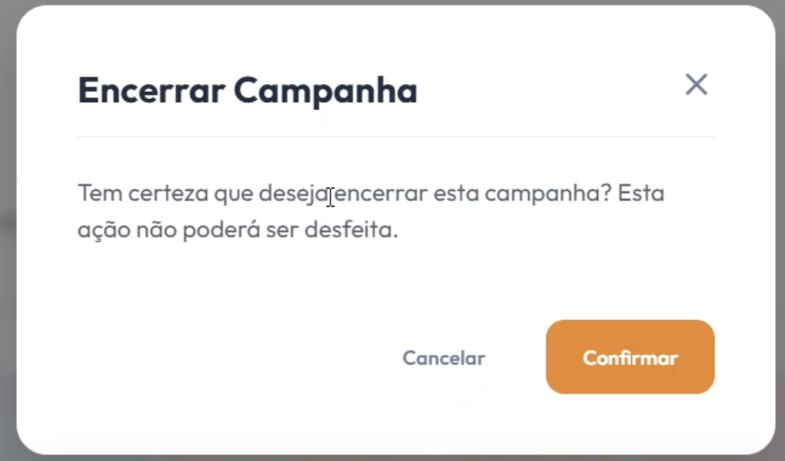

# [US09](mvp.md)
> **Como moderador, quero encerrar eventos, para bloquear novas doações ou inscrições em campanhas finalizadas.**

---

### Critérios de Aceitação

| ID | Critério de Aceite | Status |
| :--- | :--- | :---: |
| **CA01** | Apenas usuários autenticados com o perfil de "Moderador" podem disparar a ação de encerramento do evento ([RNF04](../../13_requisitos/requisitos.md#rnf04)). | completo |
| **CA02** | Ao confirmar o encerramento, o status da campanha deve mudar imediatamente para "Encerrado/Inativo" no sistema. | completo |
| **CA03** | Campanhas com o status "Encerrado" devem bloquear automaticamente qualquer nova tentativa de intenção de doação ou inscrição de voluntários. | completo |

---

### Definição de Preparado (DoR)

| Item de Verificação | Evidência / Rastreabilidade | Situação |
| :--- | :--- | :---: |
| Informação necessária para o trabalho? | Regras de alteração de status e escopo de bloqueio de fluxos operacionais alinhados com a organização. | completo |
| Representado por história de usuário? | Mapeado explicitamente na US09 no Backlog do Produto. | completo |
| Coberto por critérios de aceite? | Critérios estruturados e documentados na página de Critérios de Aceitação. | completo |
| Mapeado para um protótipo? | Estrutura do botão de ação rápida e modal de aviso crítico destrutivo modelados previamente. | completo |
| Protótipo validado pelo cliente? | Fluxo de encerramento lógico e travas sistêmicas homologados junto à coordenação da ONG. | completo |
| Coerente com a prioridade definida? | Classificado como CP1, sendo uma funcionalidade essencial para o controle e auditoria final de campanhas. | completo |
| Cabe em uma Iteração? | O escopo das travas lógicas e alteração de estado foi planejado e executado dentro do período de 22/06 a 29/06. | completo |

---

### Definição de Pronto (DoD)

| Pergunta Fundamental do DoD | Evidência de Implementação | Situação |
| :--- | :--- | :---: |
| **Entrega um incremento do produto?** | Componente do botão de encerramento e modal de confirmação de fim de campanha codificados no frontend. | completo |
| **A entrega está coerente com o protótipo?** | O layout final reflete fielmente as travas de interface, cores de alerta e avisos de encerramento projetados. | completo |
| **Contempla os critérios de aceite estabelecidos?** | Validados e revisados sem impedimentos pendentes no arquivo de checagem local do ciclo. | completo |
| **Todos os testes unitários e de integração foram aprovados?** | Testes de alteração de estado reativo e interrupção imediata dos formulários de doação executados com sucesso. | completo |
| **A entrega foi revisada e validada pela equipe?** | Homologada em ambiente de teste local e revisada pelo grupo para autorizar a consolidação na branch principal. | completo |
| **A documentação técnica foi revisada e atualizada?** | Histórico de artefatos administrativos consolidado e controle de versão sincronizado no repositório. | completo |

---

### Prototipagem

  
  

---

### Construção & Acesso

#### Fluxo de Encerramento de Eventos

* **Link para o sistema real:** [Acessar Portal Entre Amigos](https://github.com/mdsreq-fga-unb/REQ-2026.1-T01-PortalEntreAmigos.git)
* **Fluxo de Acesso:**
    1. Acesse a aplicação e certifique-se de estar autenticado com uma conta que possua perfil de "Moderador".
    2. Navegue até o painel administrativo de gerenciamento de campanhas ou acesse os detalhes da campanha ativa.
    3. Clique no botão de ação rápida focado em **"Encerrar Campanha"**.
    4. No modal sobreposto de aviso crítico, leia os alertas de bloqueio e confirme a operação.
    5. O sistema atualizará o status da campanha imediatamente para "Encerrado", desabilitando os botões de doação e inscrição para qualquer usuário da plataforma.

#### Rastreabilidade de Código
* **Código de produção homologado:** [Repositório Principal (Branch Main)](https://github.com/mdsreq-fga-unb/REQ-2026.1-T01-PortalEntreAmigos/tree/main)