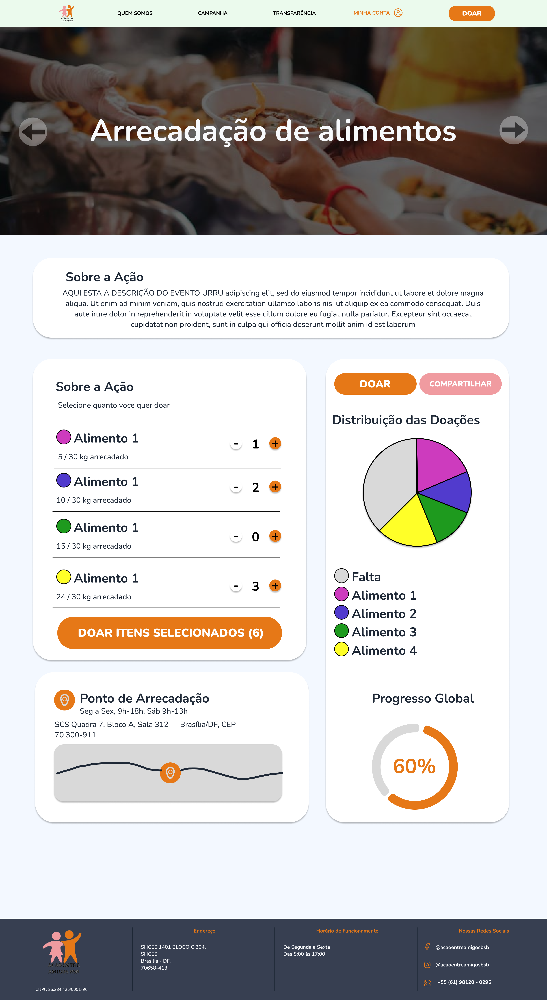

# [US11](mvp.md)
> **Como voluntário, quero registrar a minha intenção de doação, para informar antecipadamente à ONG o que irei entregar no ponto de entrega.**

---

### Critérios de Aceitação

| ID | Critério de Aceite | Status |
| :--- | :--- | :---: |
| **CA01** | O voluntário deve poder selecionar a campanha ativa e o tipo/quantidade de item que deseja doar. | completo |
| **CA02** | O sistema deve gerar um código único ou comprovante digital da "Intenção de Doação" ([RNF07](../../13_requisitos/requisitos.md#rnf07)). | completo |

---

### Definição de Preparado (DoR)

| Item de Verificação | Evidência / Rastreabilidade | Situação |
| :--- | :--- | :---: |
| Informação necessária para o trabalho? | Fluxo de seleção de itens, manipulação de quantidades e regras de confirmação de doação especificados. | completo |
| Representado por história de usuário? | Mapeado explicitamente na US11 no Backlog do Produto. | completo |
| Coberto por critérios de aceite? | Critérios estruturados e documentados na página de Critérios de Aceitação. | completo |
| Mapeado para um protótipo? | Interface de seleção de suprimentos e botões de incremento modelados na seção de Design. | completo |
| Protótipo validado pelo cliente? | Fluxo de intenção de doação e regras de feedback validados junto à coordenação da ONG. | completo |
| Coerente com a prioridade definida? | Classificado como Must Have no backlog priorizado do produto. | completo |
| Cabe em uma Iteração? | O escopo do formulário de registro de doações foi executado perfeitamente no período de 08/06 a 15/06. | completo |

---

### Definição de Pronto (DoD)

| Pergunta Fundamental do DoD | Evidência de Implementação | Situação |
| :--- | :--- | :---: |
| **Entrega um incremento do produto?** | Lógica de seleção de suprimentos, controles dinâmicos de quantidade e botão de envio implementados. | completo |
| **A entrega está coerente com o protótipo?** | O fluxo de montagem do carrinho de doações e os feedbacks refletem o design aprovado. | completo |
| **Contempla os critérios de aceite estabelecidos?** | Validados e revisados sem impedimentos pendentes no arquivo de checagem local. | completo |
| **Todos os testes unitários e de integração foram aprovados?** | Testes de interação com seletores numéricos (+/−) e validação de payload executados com sucesso. | completo |
| **A entrega foi revisada e validada pela equipe?** | Homologada em ambiente de teste pelos engenheiros responsáveis pelo ciclo de desenvolvimento. | completo |
| **A documentação técnica foi revisada e atualizada?** | Mapeamento de artefatos de doação consolidado e sincronizado no controle de versão. | completo |

---

### Prototipagem

  
  

---

### Construção & Acesso

#### Fluxo de Intenção de Doação

* **Link para o sistema real:** [Acessar Portal Entre Amigos](https://github.com/mdsreq-fga-unb/REQ-2026.1-T01-PortalEntreAmigos.git)
* **Fluxo de Acesso:**
    1. Acesse a aplicação e navegue até a página interna da campanha ativa.
    2. Localize a seção ou lista de itens de suprimentos disponíveis para arrecadação (*arroz, feijão, cobertores, etc.*).
    3. Utilize os botões de incremento e decremento (+/−) para ajustar as quantidades desejadas de cada item.
    4. Verifique o somatório dinâmico do total no contador acoplado ao botão de envio.
    5. Clique na ação **"Doar Itens Selecionados"** para registrar a intenção e receber o feedback visual imediato na tela ([RNF07](../../13_requisitos/requisitos.md#rnf07)).

#### Rastreabilidade de Código
* **Código de produção homologado:** [Repositório Principal (Branch Main)](https://github.com/mdsreq-fga-unb/REQ-2026.1-T01-PortalEntreAmigos/tree/main)