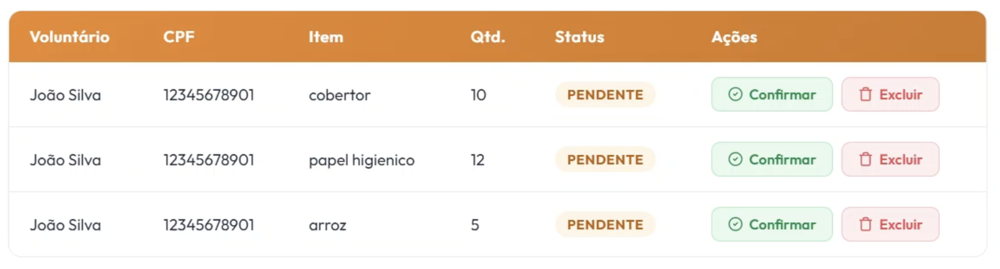

# [US12](mvp.md)
> **Como moderador, quero atualizar o saldo de mantimentos da ONG, para manter o controle preciso do volume de estoque geral disponível.**

---

### Critérios de Aceitação

| ID | Critério de Aceite | Status |
| :--- | :--- | :---: |
| **CA01** | O sistema deve permitir que o moderador ajuste manualmente a quantidade de itens no estoque geral para correções de inventário. | completo |
| **CA02** | O saldo do estoque de mantimentos deve ser recalculado e incrementado automaticamente no banco de dados assim que ele confirmar a doacao ([US13](us13.md)). | completo |
| **CA03** | O moderador podera excluir a doação | completo |
| **CA03** | A aba deve ter o nome do voluntario, CPF, Itens, Quantidade, status e ações | completo |

---

### Definição de Preparado (DoR)

| Item de Verificação | Evidência / Rastreabilidade | Situação |
| :--- | :--- | :---: |
| Informação necessária para o trabalho? | Regras de negócio para incremento/decremento manual de estoque e categorias de mantimentos totalmente mapeadas. | completo |
| Representado por história de usuário? | Mapeado explicitamente na US12 no Backlog do Produto. | completo |
| Coberto por critérios de aceite? | Critérios estruturados e documentados na página de Critérios de Aceitação. | completo |
| Mapeado para um protótipo? | Interface de gerenciamento de estoque e painel de controle de saldos por item modelados previamente. | completo |
| Protótipo validado pelo cliente? | Fluxo de conciliação de inventário e visualização de volumes homologados junto à coordenação da ONG. | completo |
| Coerente com a prioridade definida? | Classificado como CP2, sendo um pilar vital para o controle de estoque físico e transparência logística. | completo |
| Cabe em uma Iteração? | O escopo do frontend estático e regras locais foi planejado e executado dentro do período de 15/06 a 22/06. | completo |

---

### Definição de Pronto (DoD)

| Pergunta Fundamental do DoD | Evidência de Implementação | Situação |
| :--- | :--- | :---: |
| **Entrega um incremento do produto?** | Tela administrativa de controle de estoque integrada com as tabelas de saldos e listagens gerais codificada. | completo |
| **A entrega está coerente com o protótipo?** | O layout real reflete com fidelidade a tabela de itens, inputs numéricos e filtros por mantimento projetados. | completo |
| **Contempla os critérios de aceite estabelecidos?** | Validados e revisados sem impedimentos no arquivo de checagem técnica local da iteração. | completo |
| **Todos os testes unitários e de integração foram aprovados?** | Testes de controle numérico, bloqueio de entradas negativas e reatividade de dados aprovados. | completo |
| **A entrega foi revisada e validada pela equipe?** | Homologada em ambiente de teste local e validada coletivamente pelos engenheiros responsáveis do ciclo. | completo |
| **A documentação técnica foi revisada e atualizada?** | Histórico de artefatos de inventário consolidado e controle de versão sincronizado no repositório oficial. | completo |

---

### Prototipagem

  

---

### Construção & Acesso

#### Painel de Atualização e Saldo de Estoque

* **Link para o sistema real:** [Acessar Portal Entre Amigos](https://req-2026-1-t01-portalentreamigos-1.onrender.com)

* **Perfil do moderador de Teste**

| Perfil de Acesso | E-mail de Teste | Senha Padrão |
| :--- | :--- | :--- |
| **Moderador / Administrador** | `teste@gmail.com` | `zeus123` |

* **Fluxo de Acesso:**
    1. Tenha uma campanha ativa e intencoes de votos na campanha
    2. Clique em Gerenciar **Campanhas**
    3. Clique em Gerenciar **Campanha Ativa**
    3. Va para baixo até achar **"Promessas de Doação"**
    4. Clique em Confirmar para Confirmar uma doação
    5. Clique em Excluir para Excluir uma doação
    6. Apos ter Confirmado ou Excluido o site imediatamente ira atualizar o grafico abaixo

#### Rastreabilidade de Código
* **Código de produção homologado:** [Repositório Principal (Branch Main)](https://github.com/mdsreq-fga-unb/REQ-2026.1-T01-PortalEntreAmigos/tree/main)