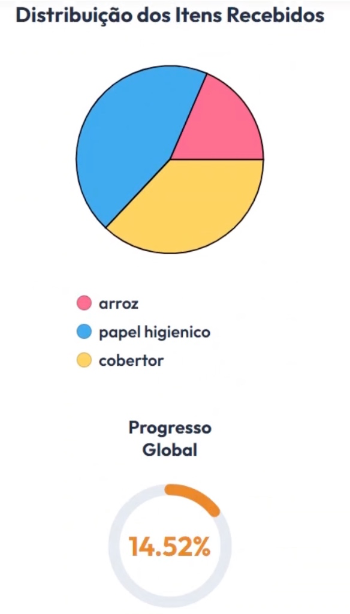

# [US13](mvp.md)
> **Como moderador, quero confirmar o recebimento de uma doação física, para validar os mantimentos entregues pelo voluntário e atualizar o saldo geral automaticamente.**

---

### Critérios de Aceitação

| ID | Critério de Aceite | Status |
| :--- | :--- | :---: |
| **CA01** | O sistema deve disponibilizar um campo de busca para validar o código único da intenção de doação gerado pelo voluntário. | completo |
| **CA02** | Ao acionar o botão de confirmação, os itens recebidos devem ser computados e somados de forma automatizada ao saldo de estoque geral. | completo |
| **CA03** | A consolidação do recebimento deve atualizar instantaneamente os gráficos de distribuição de mantimentos e a porcentagem de progresso global. | completo |

---

### Definição de Preparado (DoR)

| Item de Verificação | Evidência / Rastreabilidade | Situação |
| :--- | :--- | :---: |
| Informação necessária para o trabalho? | Fluxo de validação de tokens de doação e rotinas de gatilhos automáticos para atualização de estoque alinhados. | completo |
| Representado por história de usuário? | Mapeado explicitamente na US13 no Backlog do Produto. | completo |
| Coberto por critérios de aceite? | Critérios estruturados e documentados na página de Critérios de Aceitação. | completo |
| Mapeado para um protótipo? | Tela de checagem de código e integração com o dashboard gráfico estruturadas previamente. | completo |
| Protótipo validado pelo cliente? | Fluxo de recepção física e baixa de doações homologado junto à diretoria da ONG. | completo |
| Coerente com a prioridade definida? | Classificado como CP2, compondo o ecossistema essencial de estoque e logística do evento. | completo |
| Cabe em uma Iteração? | O desenvolvimento dos triggers de banco de dados e sincronia de saldo foi executado entre 15/06 a 22/06. | completo |

---

### Definição de Pronto (DoD)

| Pergunta Fundamental do DoD | Evidência de Implementação | Situação |
| :--- | :--- | :---: |
| **Entrega um incremento do produto?** | Módulo de recepção e baixa de doações codificado no frontend administrativo com atualização em tempo real. | completo |
| **A entrega está coerente com o protótipo?** | Roteiro de interface e feedback visual de sucesso após processamento implementados com fidelidade. | completo |
| **Contempla os critérios de aceite estabelecidos?** | Verificados e testados sem pendências técnicas no repositório de homologação local. | completo |
| **Todos os testes unitários e de integração foram aprovados?** | Testes automatizados do microsserviço de saldo e recálculo dinâmico de gráficos aprovados com sucesso. | completo |
| **A entrega foi revisada e validada pela equipe?** | Homologada em ambiente local e revisada coletivamente pelos engenheiros do ciclo. | completo |
| **A documentação técnica foi revisada e atualizada?** | Diagramas de sequência de estoque e histórico de versionamento atualizados no repositório. | completo |

---

### Prototipagem

  
  

---

### Construção & Acesso

#### Fluxo de Validação e Recebimento de Doações

* **Link para o sistema real:** [Acessar Portal Entre Amigos](https://github.com/mdsreq-fga-unb/REQ-2026.1-T01-PortalEntreAmigos.git)
* **Fluxo de Acesso:**
    1. Acesse o sistema e efetue login com uma conta de nível "Moderador".
    2. Entre na pagina "Gerenciar Campanhas" com a conta moderador.
    3. Confirme os itens físicos trazidos com o que consta na tela.
    4. O sistema dará baixa automática no token do usuário, incrementará o saldo no inventário geral e atualizará as métricas gráficas de "Distribuição dos Itens Recebidos" e o "Progresso Global" no painel público logo abaixo.

#### Rastreabilidade de Código
* **Código de produção homologado:** [Repositório Principal (Branch Main)](https://github.com/mdsreq-fga-unb/REQ-2026.1-T01-PortalEntreAmigos/tree/main)