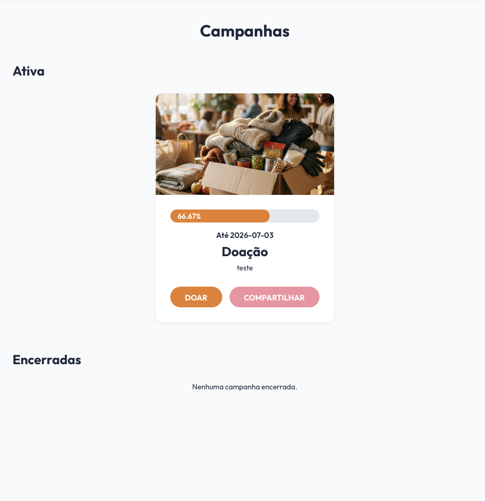
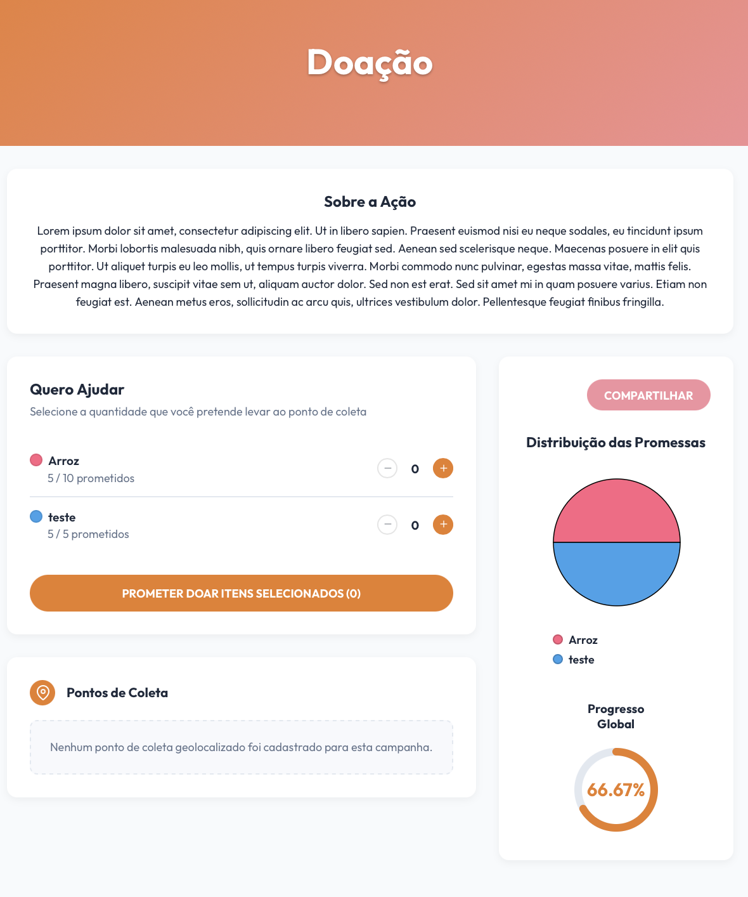

# [US14](mvp.md)
> **Como voluntário, quero exibir a vitrine de eventos ativos, para escolher qual campanha da ONG desejo ajudar.**

---

### Critérios de Aceitação

| ID | Critério de Aceite | Status |
| :--- | :--- | :---: |
| **CA01** | A Página de Campanhas deve listar a "Campanha Ativa" em destaque principal e segregar as "Últimas Campanhas Fechadas". | completo |
| **CA02** | O layout de ambas as páginas deve ser totalmente responsivo, adaptando-se perfeitamente a telas mobile e desktop ([RNF01](../../13_requisitos/requisitos.md#rf01)). | completo |
| **CA03** | A Página da Campanha deve carregar todos os dados detalhados específicos, descrição longa e objetivos da mobilização ativa selecionada. | completo |
| **CA04** | A Página da Campanha deve exibir indicadores visuais claros sobre a meta de arrecadação. | completo |

---

### Definição de Preparado (DoR)

| Item de Verificação | Evidência / Rastreabilidade | Situação |
| :--- | :--- | :---: |
| Informação necessária para o trabalho? | As regras para segmentação de campanhas ativas e últimas campanhas fechadas foram alinhadas com a ONG. | completo |
| Representado por história de usuário? | Mapeado explicitamente na US14 no Backlog do Produto. | completo |
| Coberto por critérios de aceite? | Critérios estruturados e documentados na página de Critérios de Aceitação. | completo |
| Mapeado para um protótipo? | Modelado em alta fidelidade com visões completas de listagem geral e página ativa interna no Fases RAD. | completo |
| Protótipo validado pelo cliente? | Interface com gráficos e barra de progresso apresentada e homologada pela coordenação da ONG Ação Entre Amigos BSB. | completo |
| Coerente com a prioridade definida? | Classificado como CP2, possuindo alto valor de engajamento público imediato. | completo |
| Cabe em uma Iteração? | O escopo do frontend estático foi planejado e perfeitamente executado dentro do período de 26/05 a 01/06. | completo |

---

### Definição de Pronto (DoD)

| Pergunta Fundamental do DoD | Evidência de Implementação | Situação |
| :--- | :--- | :---: |
| **Entrega um incremento do produto?** | Componentes e telas da página geral de Campanhas e página interna da Campanha Ativa codificados. | completo |
| **A entrega está coerente com o protótipo?** | O layout real reflete fielmente as seções de "Ativa", "Encerradas", o gráfico de pizza de doações e o progresso global. | completo |
| **Contempla os critérios de aceite estabelecidos?** | Validados e revisados sem impedimentos pendentes no arquivo de checagem local. | completo |
| **Todos os testes unitários e de integração foram aprovados?** | Testes de renderização de componentes e lógica de exibição estática validados na suite de testes do ciclo. | completo |
| **A entrega foi revisada e validada pela equipe?** | Homologada em ambiente local e revisada coletivamente pela equipe de desenvolvimento para autorizar o merge. | completo |
| **A documentação técnica foi revisada e atualizada?** | Mapeamento de artefatos consolidado e histórico de versão atualizado no repositório. | completo |

---

### Prototipagem

  
  

---

### Construção & Acesso

#### Vitrine de Campanhas e Eventos

* **Link para o sistema real:** [Acessar Portal Entre Amigos](https://req-2026-1-t01-portalentreamigos-1.onrender.com)
* **Fluxo de Acesso:**
    1. Acesse a aplicação e navegue até a página geral de Campanhas.
    2. Identifique o destaque visual principal voltado à Campanha Ativa para engajamento rápido de doações.
    3. Consulte a seção inferior "Últimas Campanhas Fechadas" para conferir o mural histórico e a prestação de contas de ações finalizadas.
    4. Clique sobre o card da mobilização em andamento para acessar a Página da Campanha (Interna).
    5. Analise detalhadamente a descrição de objetivos, metas de suprimentos e indicadores complementares para orientar a entrega do mantimento.

#### Rastreabilidade de Código
* **Código de produção homologado:** [Repositório Principal (Branch Main)](https://github.com/mdsreq-fga-unb/REQ-2026.1-T01-PortalEntreAmigos/tree/main)