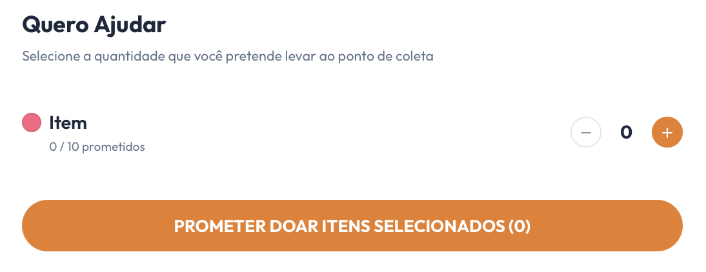

# [US15](mvp.md)
> **Como voluntário, quero me inscrever em um evento da ONG registrando uma promessa de doação, para garantir a minha participação e informar quais suprimentos levarei.**

---

### Critérios de Aceitação

| ID | Critério de Aceite | Status |
| :--- | :--- | :---: |
| **CA01** | O card do evento ativo deve exibir a barra de progresso, a data limite da ação e o botão de ação principal "DOAR". | completo |
| **CA02** | A interface deve listar os suprimentos demandados pela campanha, mostrando a relação de progresso por item (ex: "X / Y prometidos"). | completo |
| **CA03** | O usuário deve poder definir as quantidades que deseja levar utilizando seletores numéricos de incremento e decremento (+/−). | completo |
| **CA04** | O botão de confirmação deve atualizar dinamicamente o somatório total de mantimentos selecionados (ex: "PROMETER DOAR ITENS SELECIONADOS (X)"). | completo |

---

### Definição de Preparado (DoR)

| Item de Verificação | Evidência / Rastreabilidade | Situação |
| :--- | :--- | :---: |
| Informação necessária para o trabalho? | Nova regra de negócio unificando inscrição de voluntários e promessas de itens consolidada com a ONG. | completo |
| Representado por história de usuário? | Mapeado explicitamente na US15 no Backlog do Produto. | completo |
| Coberto por critérios de aceite? | Critérios reestruturados e documentados com base na dinâmica de engajamento por suprimentos. | completo |
| Mapeado para um protótipo? | Componentes de cards de chamamento e gavetas de seleção de mantimentos modelados. | completo |
| Protótipo validado pelo cliente? | Fluxo de inscrição via intenção de suprimentos validado junto à coordenação da ONG. | completo |
| Coerente com a prioridade definida? | Classificado como CP2, sendo o ponto de partida do fluxo operacional presencial de arrecadação. | completo |
| Cabe em uma Iteração? | O desenvolvimento dos seletores reativos e estados foi mapeado e executado entre 15/06 a 22/06. | completo |

---

### Definição de Pronto (DoD)

| Pergunta Fundamental do DoD | Evidência de Implementação | Situação |
| :--- | :--- | :---: |
| **Entrega um incremento do produto?** | Componentes do card de doação e modal de seleção de quantidades codificados e integrados. | completo |
| **A entrega está coerente com o protótipo?** | Layout das caixas de listagem e botões reativos reflete estritamente as especificações de design aprovadas. | completo |
| **Contempla os critérios de aceite estabelecidos?** | Validados e revisados sem impedimentos técnicos no ambiente local de desenvolvimento. | completo |
| **Todos os testes unitários e de integração foram aprovados?** | Testes de controle de estados do formulário e validação de contadores numéricos aprovados com sucesso. | completo |
| **A entrega foi revisada e validada pela equipe?** | Homologada em ambiente de teste local e aprovada coletivamente pelos engenheiros responsáveis pelo ciclo. | completo |
| **A documentação técnica foi revisada e atualizada?** | Artefatos de inscrição e versionamento de arquivos devidamente atualizados no repositório. | completo |

---

### Prototipagem

O design de interface mapeou o fluxo de participação do usuário em duas etapas integradas:

  

---

### Construção & Acesso

#### Fluxo de Inscrição via Promessa de Doação

* **Link para o sistema real:** [Acessar Portal Entre Amigos](https://req-2026-1-t01-portalentreamigos-1.onrender.com)

* **Perfil do usuario de Teste**

| Perfil de Acesso | E-mail de Teste | Senha Padrão |
| :--- | :--- | :--- |
| **Moderador / Administrador** | `testevoluntario@gmail.com` | `Zeus@123` |

* **Fluxo de Acesso:**
    1. Acesse a aplicação e navegue até a vitrine de eventos ativos.
    2. No card do evento desejado, clique no botão **"DOAR"**.
    3. Na listagem de mantimentos, observe a relação atual de arrecadação abaixo do nome de cada item (ex: "5 / 10 prometidos").
    4. Utilize as ações de incremento (+/−) para estipular a quantidade de suprimentos que você se compromete a entregar.
    5. Clique no botão de ação inferior **"PROMETER DOAR ITENS SELECIONADOS (X)"** para confirmar sua inscrição e selar o compromisso de participação com a ONG.

#### Rastreabilidade de Código
* **Código de produção homologado:** [Repositório Principal (Branch Main)](https://github.com/mdsreq-fga-unb/REQ-2026.1-T01-PortalEntreAmigos/tree/main)