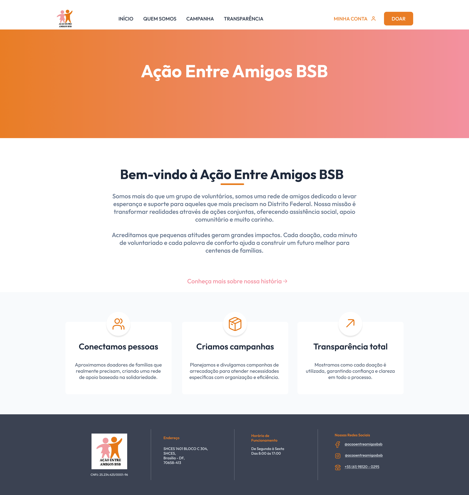

# [US16](mvp.md)
> **Como visitante, quero acessar às informações institucionais, para conhecer melhor a história, o impacto e os contatos da ONG.**

---

### Critérios de Aceitação

| ID | Critério de Aceite | Status |
| :--- | :--- | :---: |
| **CA01** | A página "Sobre Nós" (ou "Quem Somos") deve estar acessível de forma pública, sem qualquer necessidade de login. | completo |
| **CA02** | O layout das páginas institucionais deve ser totalmente responsivo, adaptando-se a telas mobile, tablet e desktop ([RNF01](../../13_requisitos/requisitos.md#rf01)). | completo |

---

### Definição de Preparado (DoR)

| Item de Verificação | Evidência / Rastreabilidade | Situação |
| :--- | :--- | :---: |
| Informação necessária para o trabalho? | Dados institucionais, história e diretrizes (Missão, Visão e Valores) foram completamente levantados junto à ONG. | completo |
| Representado por história de usuário? | Mapeado explicitamente na US16 no Backlog do Produto. | completo |
| Coberto por critérios de aceite? | Critérios estruturados e documentados na página de Critérios de Aceitação. | completo |
| Mapeado para um protótipo? | Modelado em alta fidelidade para as visões Desktop e Mobile na seção de Design. | completo |
| Protótipo validado pelo cliente? | Interface avaliada e aprovada pela coordenação da ONG Ação Entre Amigos BSB antes da codificação. | completo |
| Coerente com a prioridade definida? | Classificado como essencial para a fundação da identidade digital da plataforma na Matriz do Backlog. | completo |
| Cabe em uma Iteração? | Escopo estático e focado em frontend perfeitamente compatível com o período de 26/05 a 01/06. | completo |

---

### Definição de Pronto (DoD)

| Pergunta Fundamental do DoD | Evidência de Implementação | Situação |
| :--- | :--- | :---: |
| **Entrega um incremento do produto?** | Telas funcionais da *Home* e *Quem Somos* codificadas e integradas ao ecossistema do projeto. | completo |
| **A entrega está coerente com o protótipo?** | Estrutura visual, componentes e disposição dos elementos batem 100% com o design proposto. | completo |
| **Contempla os critérios de aceite estabelecidos?** | Validados e revisados sem inconformidades pendentes no arquivo de checagem local. | completo |
| **Todos os testes unitários e de integração foram aprovados?** | Cobertura estática e testes de renderização executados com sucesso pela equipe técnica. | completo |
| **A entrega foi revisada e validada pela equipe?** | Homologada em ambiente local pelo trio de responsáveis e revisada coletivamente pelo grupo. | completo |
| **A documentação técnica foi revisada e atualizada?** | Esta documentação e o histórico de versão do ciclo foram devidamente consolidados no repositório. | completo |

---

### Prototipagem

  
  

---

### Construção & Acesso

#### Informações Institucionais

* **Link para o sistema real:** [Acessar Portal Entre Amigos](https://req-2026-1-t01-portalentreamigos-1.onrender.com)
* **Fluxo de Acesso:**
    1. Acesse a URL inicial da aplicação (a página Home estará visível publicamente sem necessidade de autenticação).
    2. Visualize as ações correntes, métricas operacionais e o impacto social geral da organização.
    3. No menu ou barra de navegação superior, selecione o link direcionado à página **"Quem Somos"**.
    4. Explore a narrativa histórica da fundação da ONG, acompanhada das diretrizes organizacionais de *Missão, Visão e Valores*.

#### Rastreabilidade de Código
* **Código de produção homologado:** [Repositório Principal (Branch Main)](https://github.com/mdsreq-fga-unb/REQ-2026.1-T01-PortalEntreAmigos/tree/main)