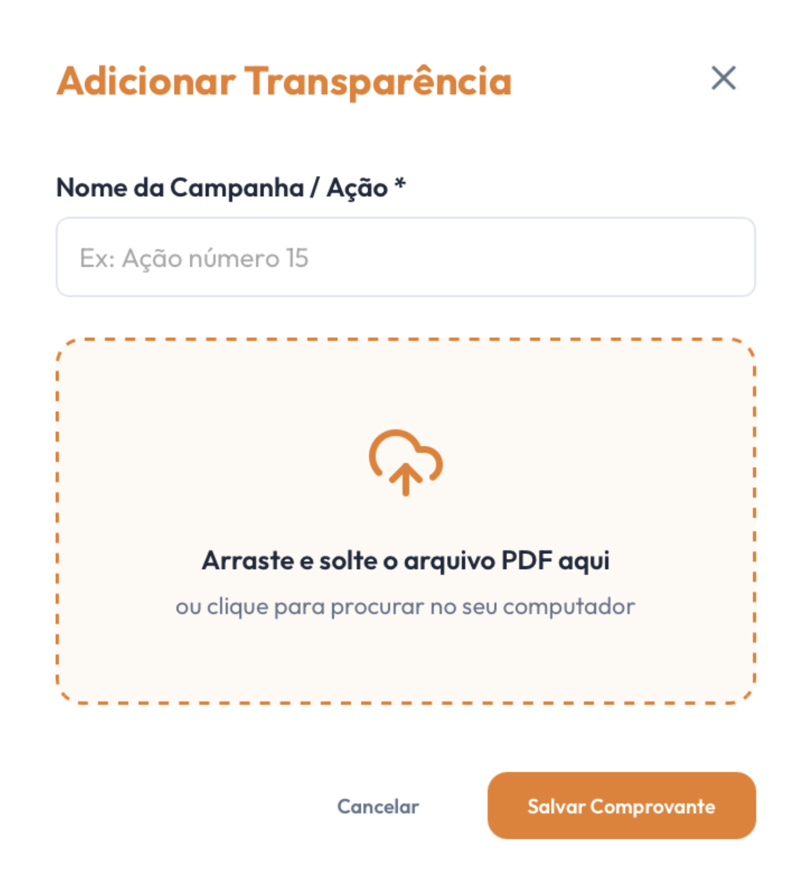

# [US18](mvp.md)
> **Como moderador, quero enviar as notas fiscais e comprovantes de um evento finalizado, para disponibilizar os arquivos para consulta pública no painel de transparência.**

---

### Critérios de Aceitação

| ID | Critério de Aceite | Status |
| :--- | :--- | :---: |
| **CA01** | O sistema deve exigir obrigatoriamente o preenchimento do campo "Nome da Campanha / Ação" antes de liberar o salvamento. | completo |
| **CA02** | O modal deve conter uma área de upload do tipo *drag-and-drop* configurada exclusivamente para aceitar arquivos em formato PDF ([RNF10](../../13_requisitos/requisitos.md#rnf10)). | completo |
| **CA03** | A ação de clicar no botão "Salvar Comprovante" deve processar o upload, validar o payload no backend e publicar instantaneamente a linha de prestação de contas na listagem pública. | completo |
| **CA04** | O botão de acionamento do modal e o envio dos arquivos devem estar restritos e protegidos por controle de nível de acesso administrativo ([RNF04](../../13_requisitos/requisitos.md#rnf04)). | completo |

---

### Definição de Preparado (DoR)

| Item de Verificação | Evidência / Rastreabilidade | Situação |
| :--- | :--- | :---: |
| Informação necessária para o trabalho? | Especificação de limites de tamanho de arquivo (5MB) e regras de validação cadastral do formulário alinhadas. | completo |
| Representado por história de usuário? | Mapeado explicitamente na US18 no Backlog do Produto. | completo |
| Coberto por critérios de aceite? | Critérios estruturados e validados com foco no fluxo de entrada e persistência de arquivos. | completo |
| Mapeado para um protótipo? | Roteiro de interface em formato modal sobreposto focado na facilidade de inserção de múltiplos documentos modelado. | completo |
| Protótipo validado pelo cliente? | Modal de inserção de comprovantes homologado junto à coordenação técnica e administrativa da ONG. | completo |
| Coerente com a prioridade definida? | Classificado como CP5, fornecendo os insumos e arquivos necessários para alimentar a prestação de contas do sistema. | completo |
| Cabe em uma Iteração? | O escopo de componentes de upload e manipulação de arquivos foi executado perfeitamente entre 22/06 a 29/06. | completo |

---

### Definição de Pronto (DoD)

| Pergunta Fundamental do DoD | Evidência de Implementation | Situação |
| :--- | :--- | :---: |
| **Entrega um incremento do produto?** | Modal funcional de upload de comprovantes codificado e integrado à interface restrita de Transparência. | completo |
| **A entrega está coerente com o protótipo?** | Disposição de inputs, ícones de upload, botões de ação e regras de layout fiéis ao prototipo. | completo |
| **Contempla os critérios de aceite estabelecidos?** | Validados, revisados e inspecionados sem inconformidades ou impedimentos na branch de desenvolvimento. | completo |
| **Todos os testes unitários e de integração foram aprovados?** | Testes de barramento de tipos de arquivos não autorizados e obrigatoriedade de campos aprovados na suíte local. | completo |
| **A entrega foi revisada e validada pela equipe?** | Homologada em ambiente de teste local e aprovada coletivamente para merge na branch de produção. | completo |
| **A documentação técnica foi revisada e atualizada?** | Artefatos de armazenamento e histórico de modificações sincronizados no repositório. | completo |

---

### Prototipagem

  

---

### Construção & Acesso

#### Fluxo de Envio e Cadastro de Comprovantes

* **Link para o sistema real:** [Acessar Portal Entre Amigos](https://github.com/mdsreq-fga-unb/REQ-2026.1-T01-PortalEntreAmigos.git)
* **Fluxo de Acesso:**
    1. Acesse o sistema e certifique-se de estar autenticado com uma conta de nível "Moderador".
    2. No menu principal, dirija-se à aba **"Transparência"**.
    3. Clique no botão de ação administrativa **"+ Adicionar Transparência"**.
    4. No modal sobreposto que se abrirá, preencha o campo obrigatório **"Nome da Campanha / Ação"** indicando o título da mobilização correspondente.
    5. Arraste o arquivo de prestação de contas consolidado do seu computador e solte-o sobre a área delimitada tracejada, ou clique nela para selecionar o arquivo PDF manualmente através do gerenciador de arquivos.
    6. Verifique o feedback de carregamento e clique no botão **"Salvar Comprovante"** para concluir o envio, disparar as validações de backend e publicar o novo relatório.

#### Rastreabilidade de Código
* **Código de produção homologado:** [Repositório Principal (Branch Main)](https://github.com/mdsreq-fga-unb/REQ-2026.1-T01-PortalEntreAmigos/tree/main)