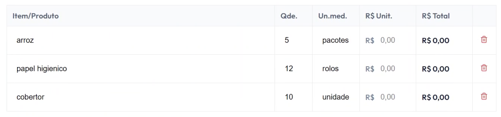

# [US19](mvp.md)
> **Como moderador, quero gerar um relatório com as informações detalhadas do evento, para consolidar os dados de voluntários, doações físicas, financeiras e despesas em um único documento de prestação de contas.**

---

### Critérios de Aceitação

| ID | Critério de Aceite | Status |
| :--- | :--- | :---: |
| **CA01** | O sistema deve disponibilizar um botão de ação "Exportar Relatório" nas páginas de gerenciamento de campanhas finalizadas. | completo |
| **CA02** | O relatório gerado deve compilar de forma integrada: total de voluntários inscritos ([US15](us15.md)), balanço de mantimentos recebidos ([US13](us13.md)), doações financeiras e notas de despesas anexadas ([US18](us18.md)). | completo |
| **CA03** | O sistema deve permitir que o moderador adicione ou ajuste manualmente linhas de itens, quantidades, unidades de medida e valores monetários para aportes ou ajustes externos. | completo |
| **CA04** | O arquivo gerado para download deve ser estruturado em formatos padrão de mercado (ex: PDF ou CSV) para garantir portabilidade. | completo |
| **CA05** | O acesso à rotina de compilação de dados e geração de relatórios gerenciais deve ser restrita exclusivamente ao perfil de "Moderador" ([RNF04](../../13_requisitos/requisitos.md#rnf04)). | completo |

---

### Definição de Preparado (DoR)

| Item de Verificação | Evidência / Rastreabilidade | Situação |
| :--- | :--- | :---: |
| Informação necessária para o trabalho? | Regras de agregação de dados e mapeamento da tabela de lançamentos manuais externos consolidadas. | completo |
| Representado por história de usuário? | Mapeado explicitamente na US19 no Backlog do Produto. | completo |
| Coberto por critérios de aceite? | Critérios validados incluindo a flexibilidade de inserção manual de produtos e custos por fora. | completo |
| Mapeado para um protótipo? | Visualização prévia da tabela de sumário e botões de exportação modelados em alta fidelidade. | completo |
| Protótipo validado pelo cliente? | Modelo de layout e colunas do relatório gerencial aprovados pela coordenação geral da ONG. | completo |
| Coerente com a prioridade definida? | Classificado como Must Have (CP5) por se tratar do fechamento contábil e de compliance da plataforma. | completo |
| Cabe em uma Iteração? | O desenvolvimento da engine de compilação e exportação de PDF foi executado de 22/06 a 29/06. | completo |

---

### Definição de Pronto (DoD)

| Pergunta Fundamental do DoD | Evidência de Implementação | Situação |
| :--- | :--- | :---: |
| **Entrega um incremento do produto?** | Serviço de renderização, edição de grade e download de relatórios integrado ao banco de dados e funcional. | completo |
| **A entrega está coerente com o protótipo?** | Rótulos, agrupamentos de seções, tabela de produtos e botões de download fiéis ao layout validado. | completo |
| **Contempla os critérios de aceite estabelecidos?** | Inspecionados, testados e validados em ambiente local sem qualquer impedimento lógico ou técnico. | completo |
| **Todos os testes unitários e de integração foram aprovados?** | Testes de reatividade da tabela de insumos, cálculos de totais e integridade do arquivo exportado concluídos. | completo |
| **A entrega foi revisada e validada pela equipe?** | Homologada em ambiente local e revisada pelo time de desenvolvimento na reunião de encerramento do ciclo. | completo |
| **A documentação técnica foi revisada e updated?** | Arquivos de mapeamento, esquemas de dados e histórico de versões consolidados no repositório principal. | completo |

---

### Prototipagem

  
  

---

### Construção & Acesso

#### Geração de Relatórios e Inserção Manual de Itens

* **Link para o sistema real:** [Acessar Portal Entre Amigos](https://github.com/mdsreq-fga-unb/REQ-2026.1-T01-PortalEntreAmigos.git)
* **Fluxo de Acesso:**
    1. Acesse a plataforma e certifique-se de estar logado com credenciais de perfil "Moderador".
    2. No menu administrativo do sistema, clique na opção **"Campanhas"** 
    3. Clique em encerrar campanha e confirme
    4. Avalie a tabela estruturada de conferência de balanço em tela
    5. Caso queira adicionar mais comprovantes, arraste para caixa de "Comprovantes"
    5. Clique no botão de ação **"Finalizar e Exportar Relatorio"**.
    6. O sistema ira te devolver o PDF e encerrar a ação.

#### Rastreabilidade de Código
* **Código de produção homologado:** [Repositório Principal (Branch Main)](https://github.com/mdsreq-fga-unb/REQ-2026.1-T01-PortalEntreAmigos/tree/main)