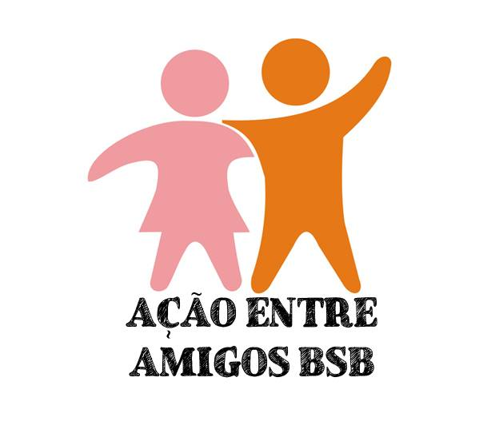

# Projeto de Requisitos de Software 2026.1 - Grupo 1

Esta página reúne toda a documentação desenvolvida ao longo da disciplina de Requisitos de Software (2026.1), ministrada pelo professor George Marsicano Correa na Universidade de Brasília (UnB).

O objetivo deste site é centralizar, organizar e apresentar de forma clara todos os artefatos produzidos pela equipe durante o desenvolvimento do projeto.

    

Figura 1: Logo Ação Entre Amigos

Fonte: Elaborada pelo Grupo

A **Ação Entre Amigos BSB** é uma organização não governamental (ONG), sem fins lucrativos, que atua na coleta, gestão e distribuição de doações para comunidades em situação de vulnerabilidade social no Distrito Federal. Fundada em 2013, a iniciativa surgiu a partir de ações solidárias realizadas por voluntários e, ao longo do tempo, cresceu significativamente, consolidando-se como uma organização estruturada e com forte impacto social.

## Objetivo do Projeto

O objetivo deste trabalho é aplicar os conceitos, técnicas e práticas da Engenharia de Requisitos no contexto de uma organização real, realizando o levantamento, análise, documentação e validação dos requisitos de software necessários para o desenvolvimento da solução proposta.

## Integrantes - Grupo 1

<table>
  <tr>
    <td align="center"><a href="https://github.com/GuilhermeOliveira1327"> <b>GUILHERME OLIVEIRA</b></a> 
    <td align="center"><a href="https://github.com/ArturFGaldino"> <b>ARTUR FERNANDES GALDINO</b></a> 
    <td align="center"><a href="https://github.com/surpesaiajin"> <b>LEONARDO DE AQUINO SILVEIRA BRAGA</b></a> 
    <td align="center"><a href="https://github.com/KaioAmouryUnB"> <b>KAIO AMOURY SASAKI ACÁCIO</b></a> 
    <td align="center"><a href="https://github.com/edso-n"> <b>EDSON PEREIRA ROLDAO FILHO</b></a> 
    <td align="center"><a href="https://github.com/GUGOFO"> <b>GUSTAVO GOMES FORNACIARI</b></a> 
  </tr>
</table>

## Histórico de versão

| Versão |    Data    | Descrição  | Autor(es) | Revisor(es)|
| :----: | :--------: | :--------- | :-------: | :---------: |
|  1.0   | 12/04/2026 | Criação da Home     |  [Guilherme](https://github.com/GuilhermeOliveira1327)  | [Gustavo](https://github.com/GUGOFO) |